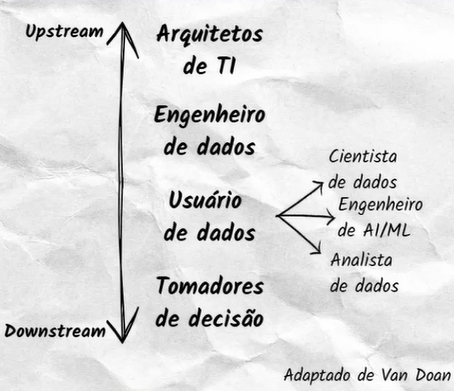
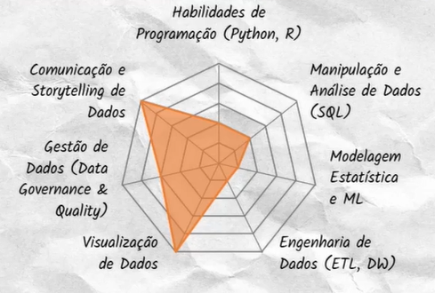
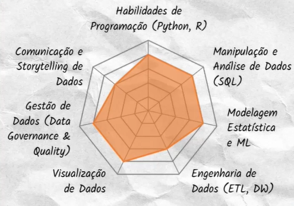
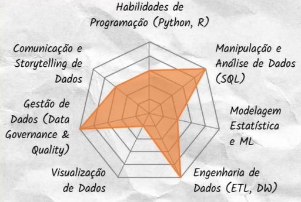

# O trabalho de um analista de dados

## Personas de dados

### Níveis de personas

### Analista de dados
Investigar e interpretar os dados para gerar insights valiosos.

### Cientista de dados
Prever tendências futuras e otimizar tomada de decisões.

### Engenheiro de dados
Garantir que os dados certos estejam disponíveis para consumo.
