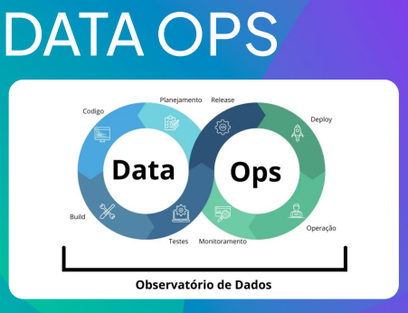
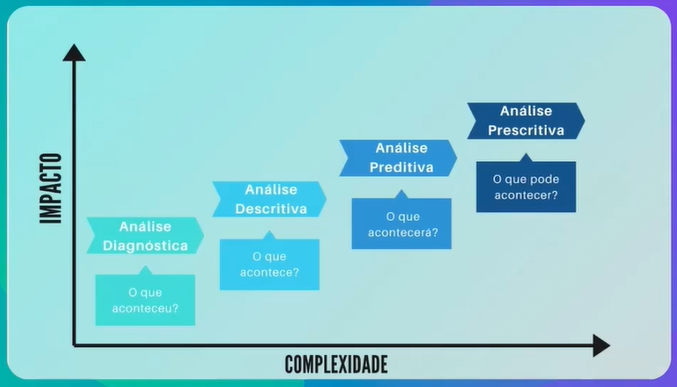

# O trabalho de um analista de dados

## Personas de dados

### Níveis de personas

### Analista de dados

Investigar e interpretar os dados para gerar insights valiosos.

### Cientista de dados

Prever tendências futuras e otimizar tomada de decisões.

### Engenheiro de dados

Garantir que os dados certos estejam disponíveis para consumo.

## Metodologias de dados

### CRISP-DM

### Lean Analytics

### Data Ops

### A/B Testing

## Base conceitual de dados

### Tipos de análises

