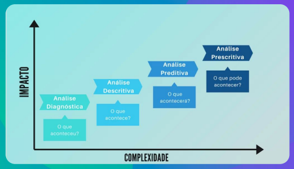

# Entendendo o problema

## Tipos de demandas de dados

### Tipos de análises

### Análise exploratória

### Análise descritiva

### Análise diagnóstica

### Análise preditiva

### Análise prescritiva

## Perguntas de dados

### Refinando uma pergunta

### S.M.A.R.T

### Perguntas para refinar

