# Estatística descritiva

## Introdução

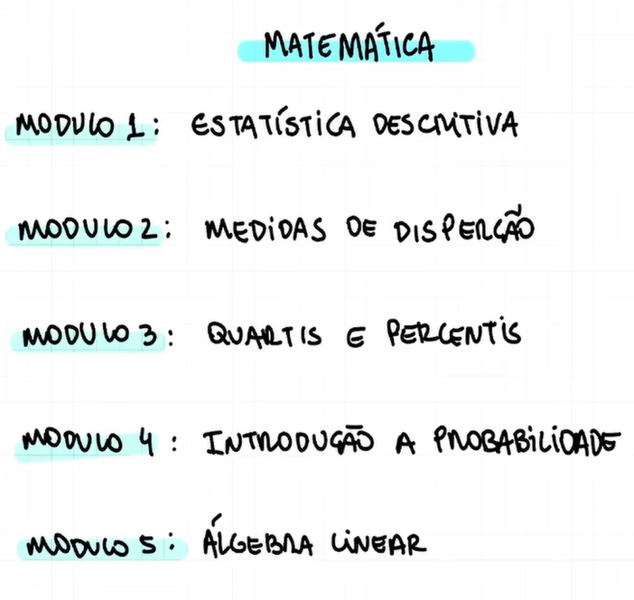

## Estatistica descritiva

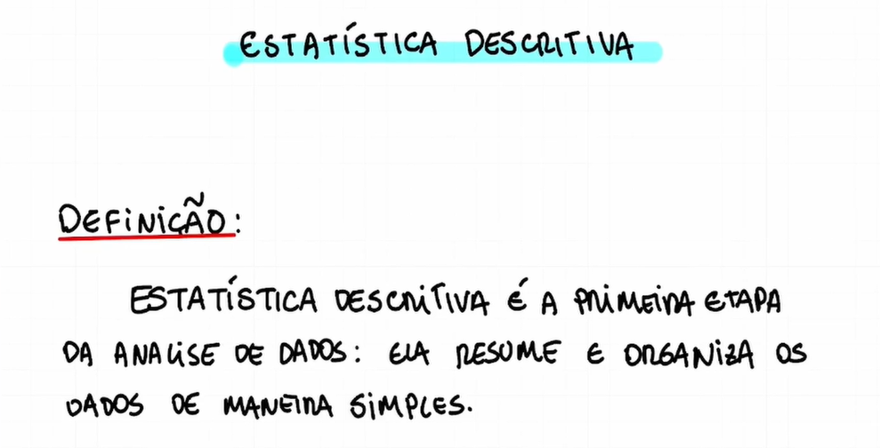

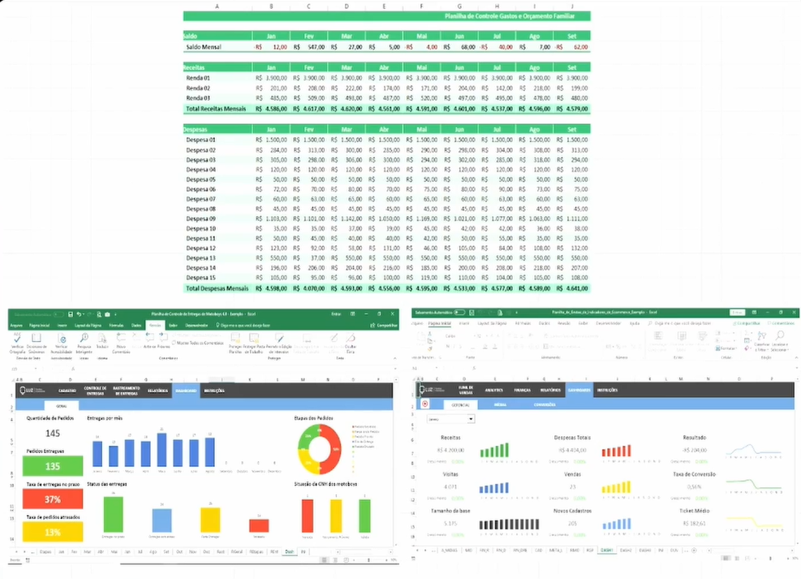

## Conceitos importantes

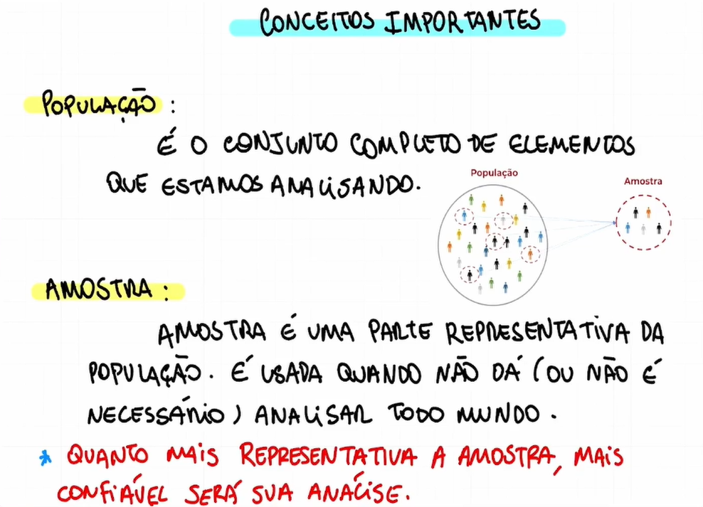

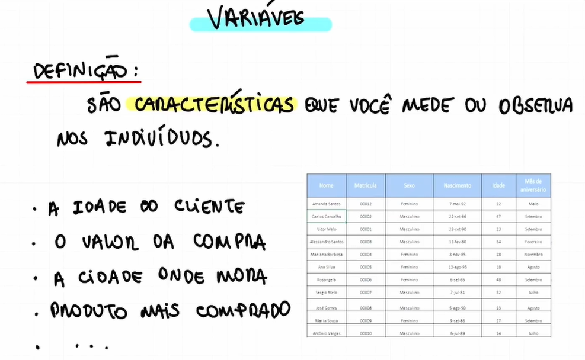

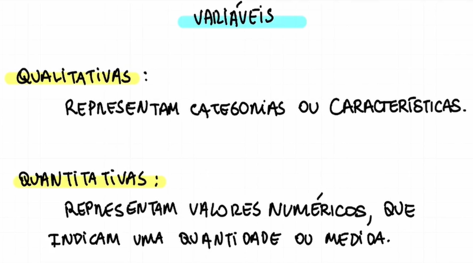

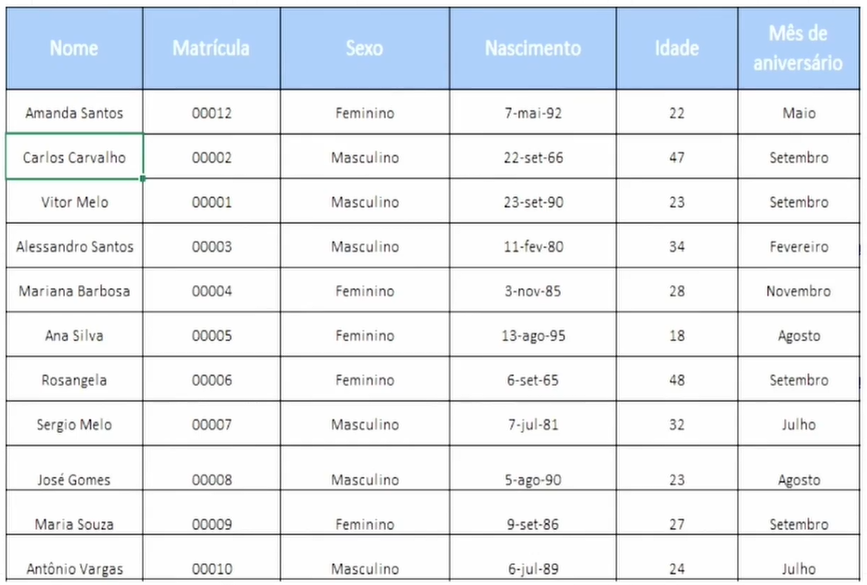

## Média aritmética

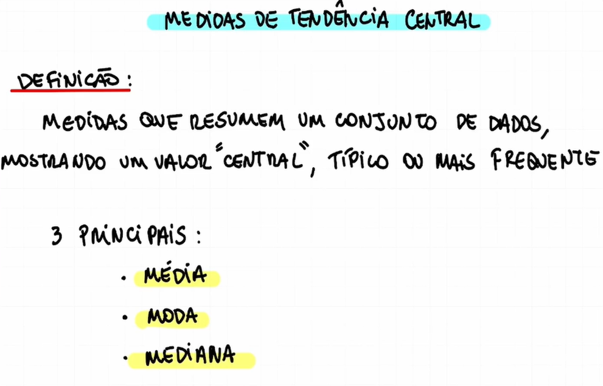

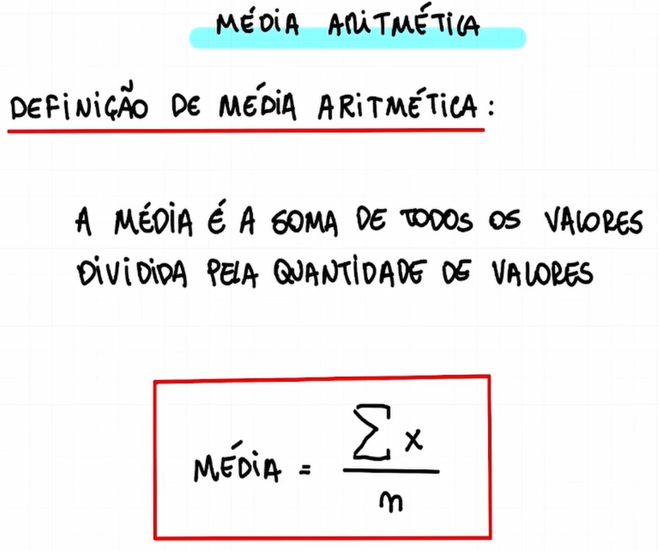

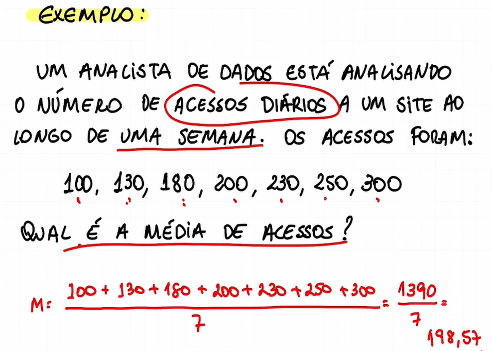

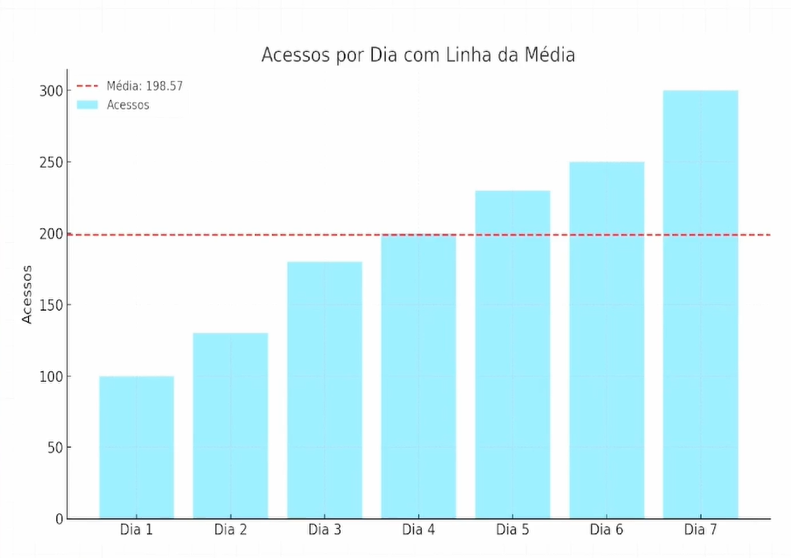

## Moda e Mediana

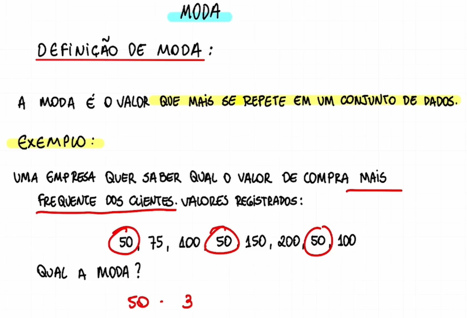

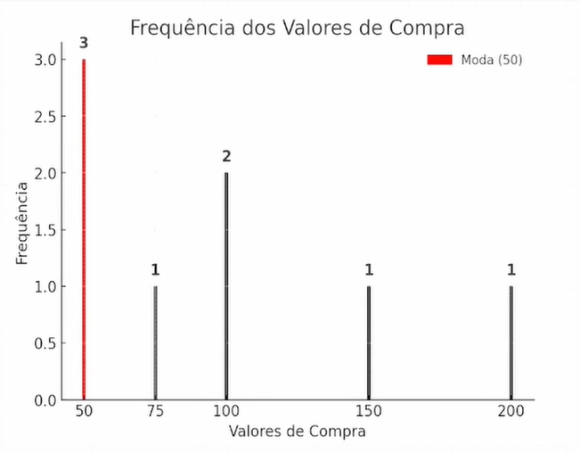

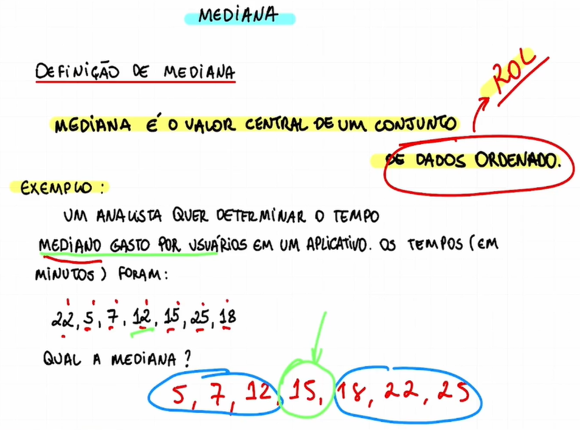

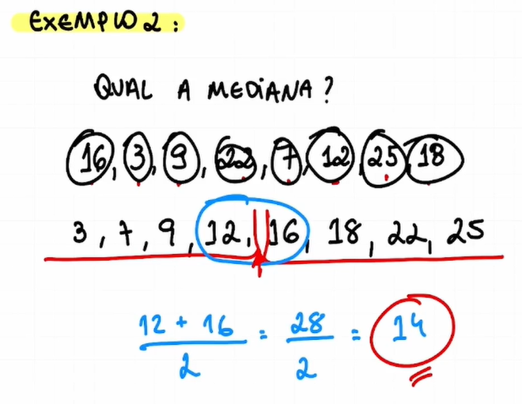

## Exercícios

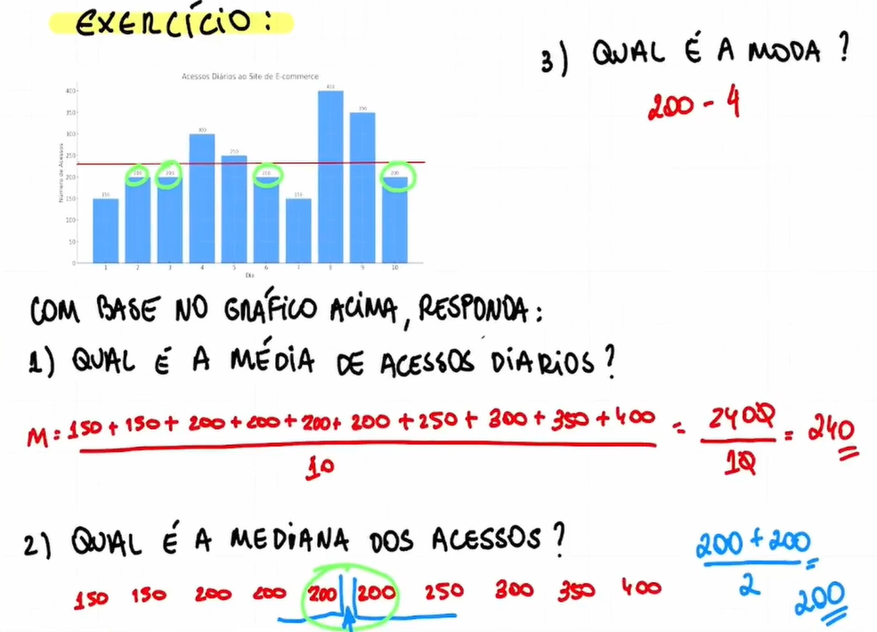
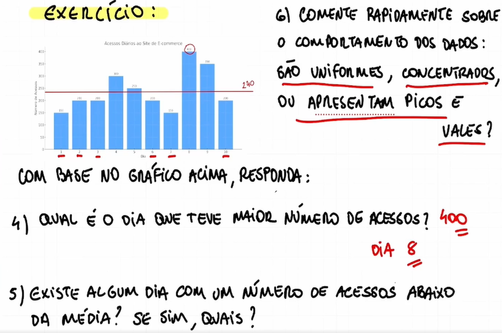

Exercício 1 - Resposta:

```
  x = (150 + 200 + 200 + 300 + 250 + 200 + 150 + 400 + 350 + 200) / 10
  x = 2.400 / 10
  x = 240
```

Exercício 2 - Resposta:

```
  150 150 200 200 200 200 250 300 350 400

  x = 200 + 200 / 2
  x = 400 / 2
  x = 200
```

Exercício 3 - Resposta:

```
  x = 200
```

Exercício 4 - Resposta:

```
  Dia 8, com 400 acessos.
```

Exercício 5 - Resposta:

```
  Sim, dias 1, 2, 3, 6, 7 e 10.
```

Exercício 6 - Resposta:

```
  Apresentam picos e vales.
```
