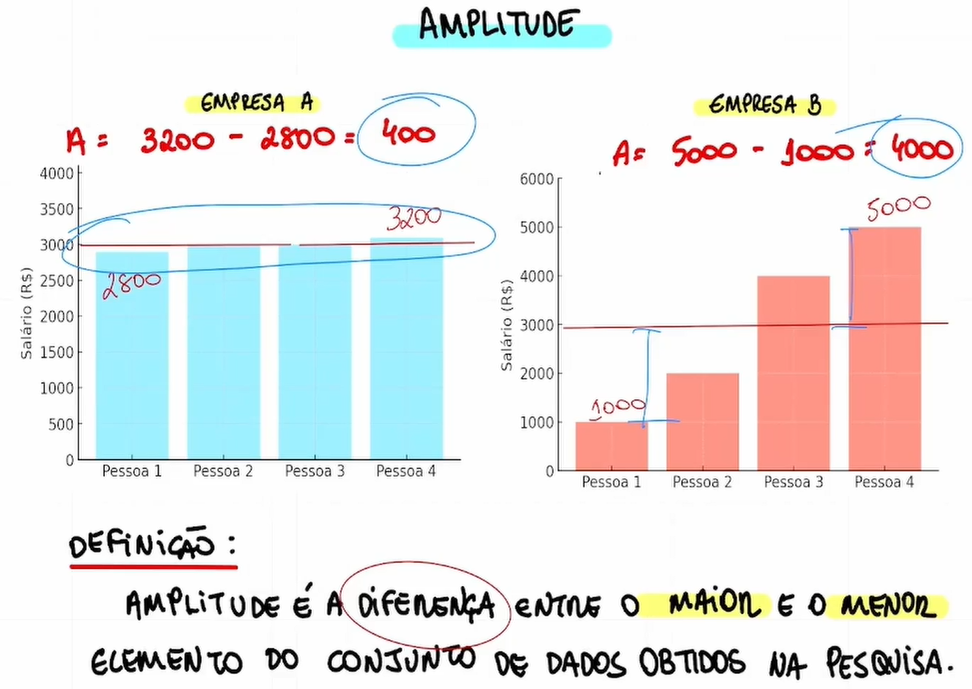
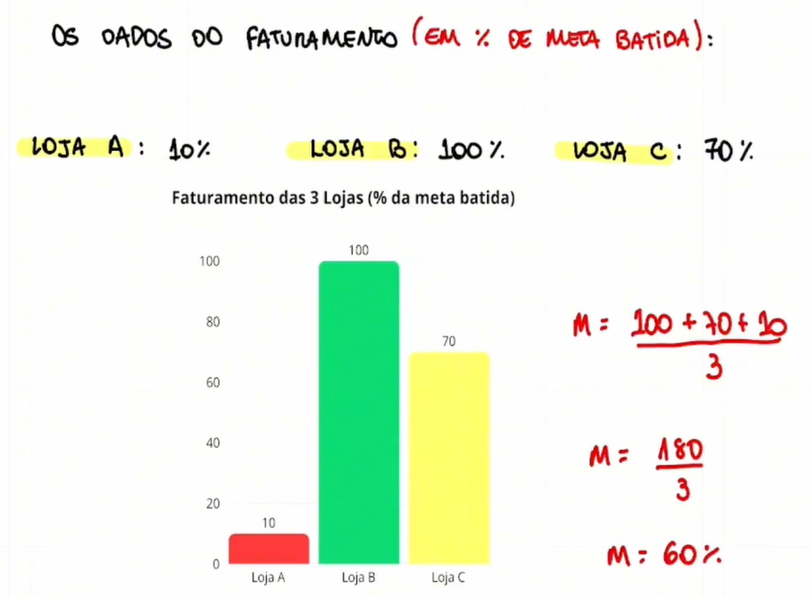
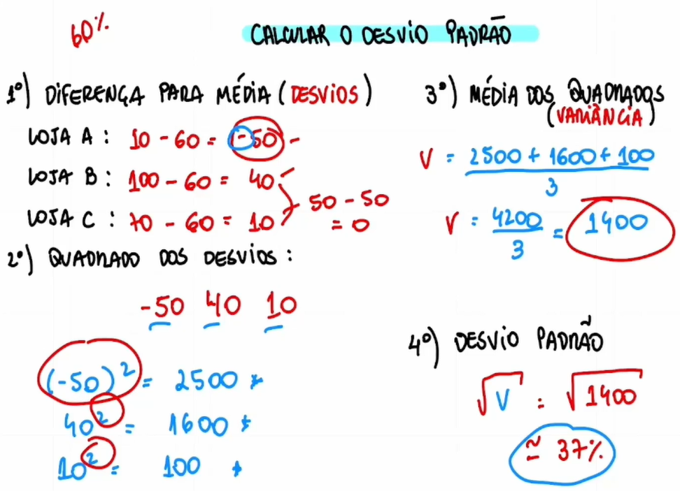
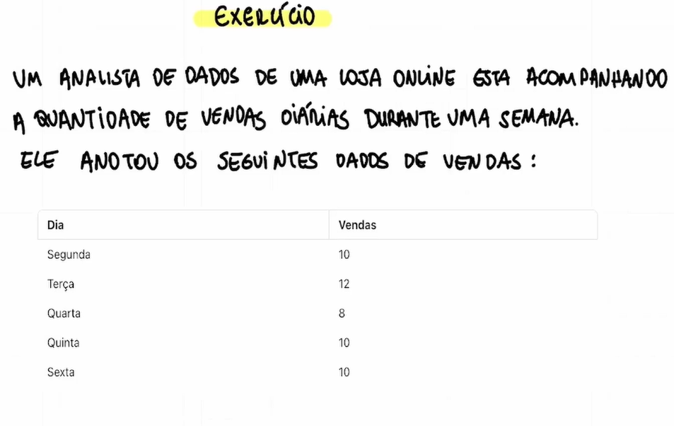
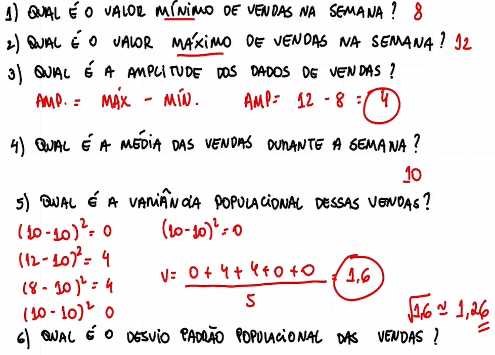

# Medidas de dispersão

## Amplitude



## Variância e desvio padrão






## Exercícios




Exercício 1 - Resposta:

```
  O valor minímo de vendas foi na quarta-feira, com 8 vendas.
```

Exercício 2 - Resposta:

```
  O valor máximo de vendas foi na terça-feira, com 12 vendas.
```

Exercício 3 - Resposta:

```
  x = 12 - 8
  x = 4
```

Exercício 4 - Resposta:

```
  x = (10 + 12 + 8 + 10 + 10) / 5
  x = 50 / 5
  x = 10
```

Exercício 5 - Resposta:

```
  (10 - 10) ** 2 = 0
  (12 - 10) ** 2 = 4
  (8 - 10) ** 2 = 4
  (10 - 10) ** 2 = 0
  (10 - 10) ** 2 = 0

  x = 0 + 4 + 4 + 0 + 0 / 5
  x = 8 / 5
  x = 1,6
```

Exercício 6 - Resposta:

```
  Raíz de 1,6 ~= 1,26
```
