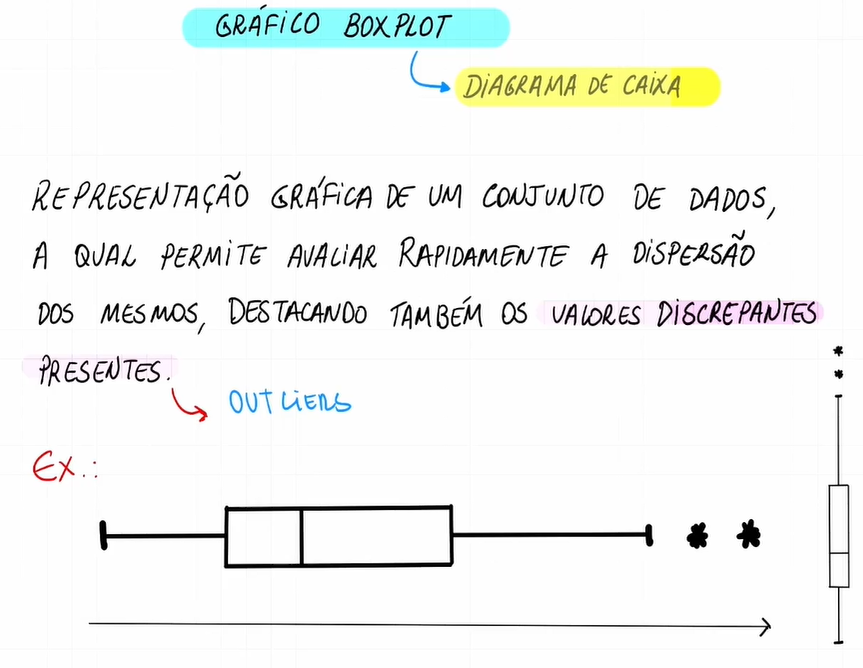
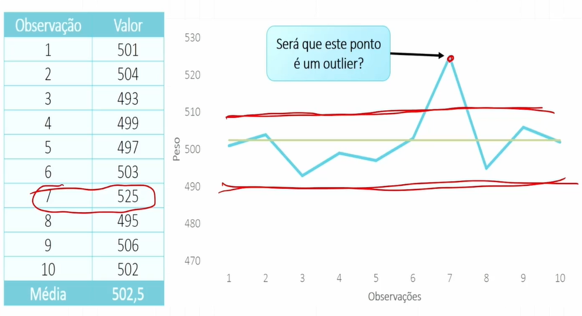
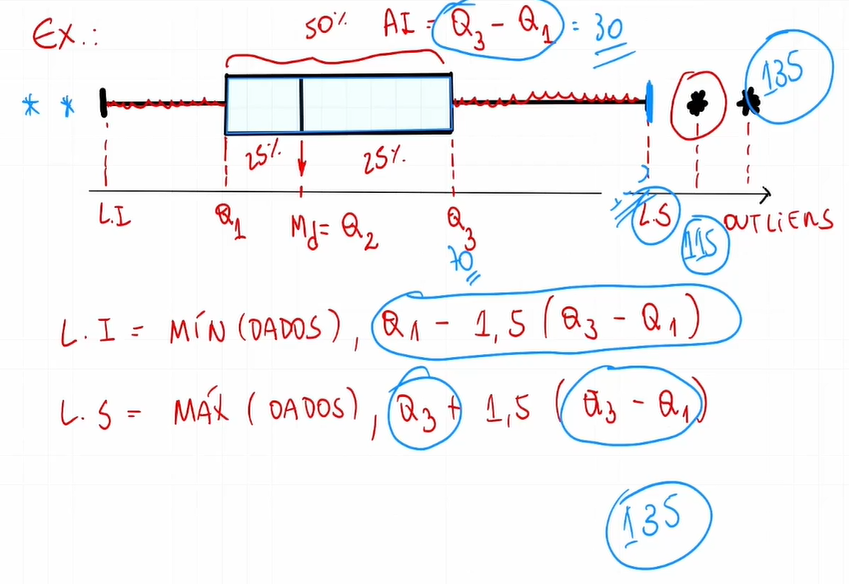
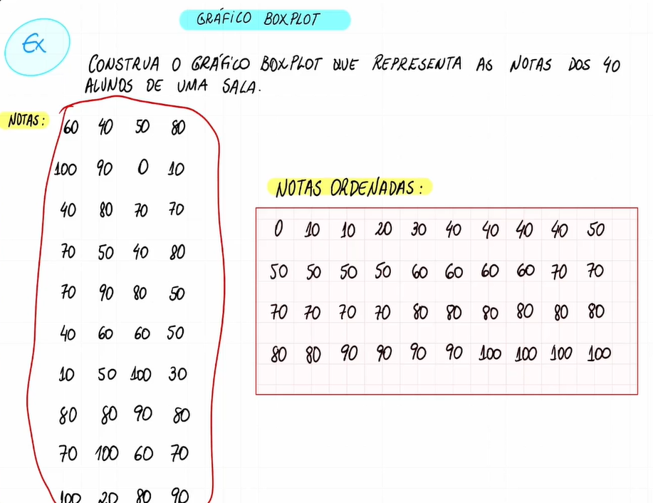
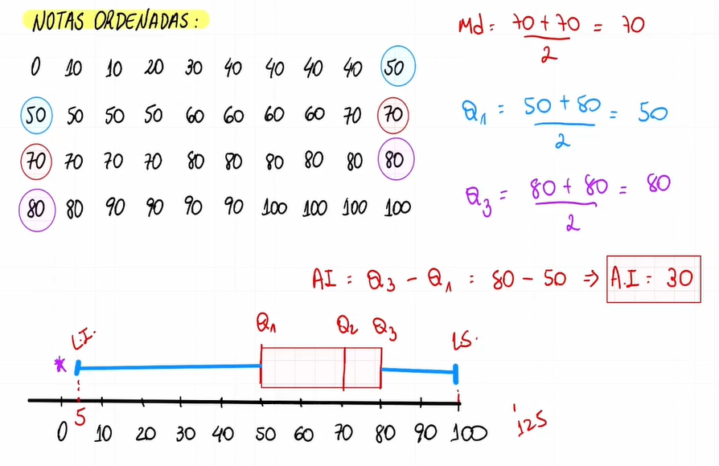

# Medidas de posição

## Quartis


## Quartil Intervalo


## Percentil


## Amplitude interquartil


## Amplitude interquartil: Exercício


Exercício - Resposta:

```
  7, 8, 8, 9, 10, 10, 10, 12, 12, 14

  q1 = 8

  q2 = 10 + 10 / 2
  q2 = 20 / 2
  q2 = 10

  q3 = 12

  ai = 12 - 8
  ai = 4
```

## Gráfico BoxPlot





## Gráfico BoxPlot: Exercício




Exercício - Resposta:

```
  0, 10, 10, 20, 30, 40, 40, 40, 40, 50
  50, 50, 50, 50, 60, 60, 60, 60, 70, 70
  70, 70, 70, 70, 80, 80, 80, 80, 80, 80
  80, 80, 90, 90, 90, 90, 100, 100, 100, 100

  md = 70 + 70 / 2
  md = 140 / 2
  md = 70

  q1 = 50 + 50 / 2
  q1 = 100 / 2
  q1 = 50

  q3 = 80 + 80 / 2
  q3 = 160 / 2
  q3 = 80

  ai = 80 - 50
  ai = 30
```
