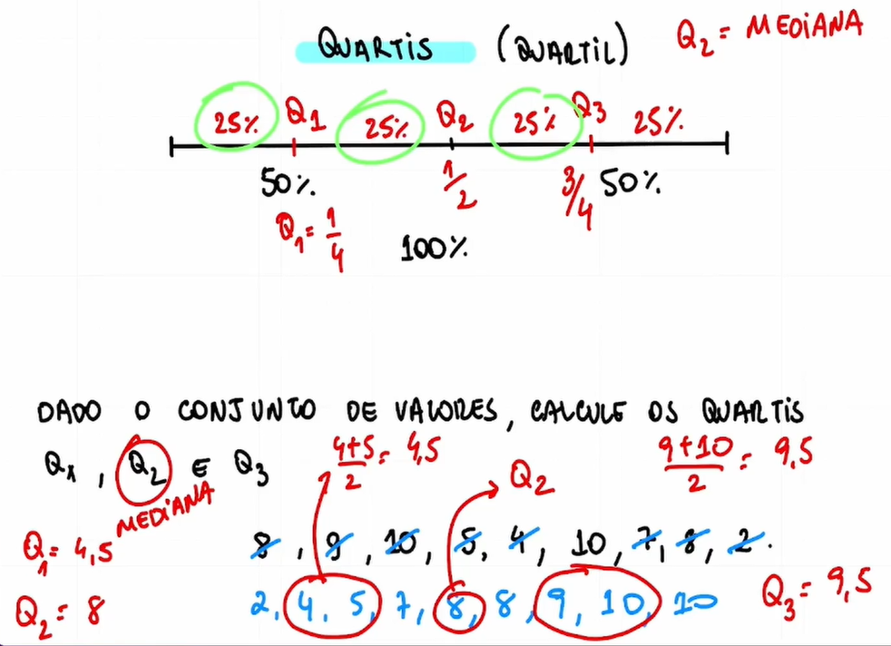
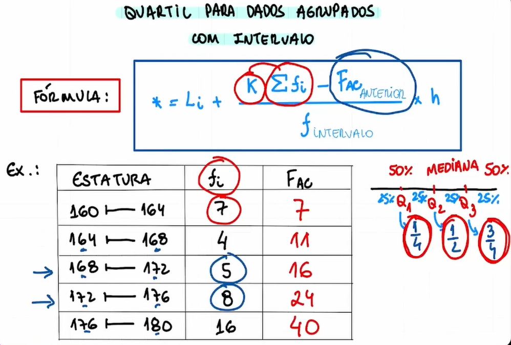
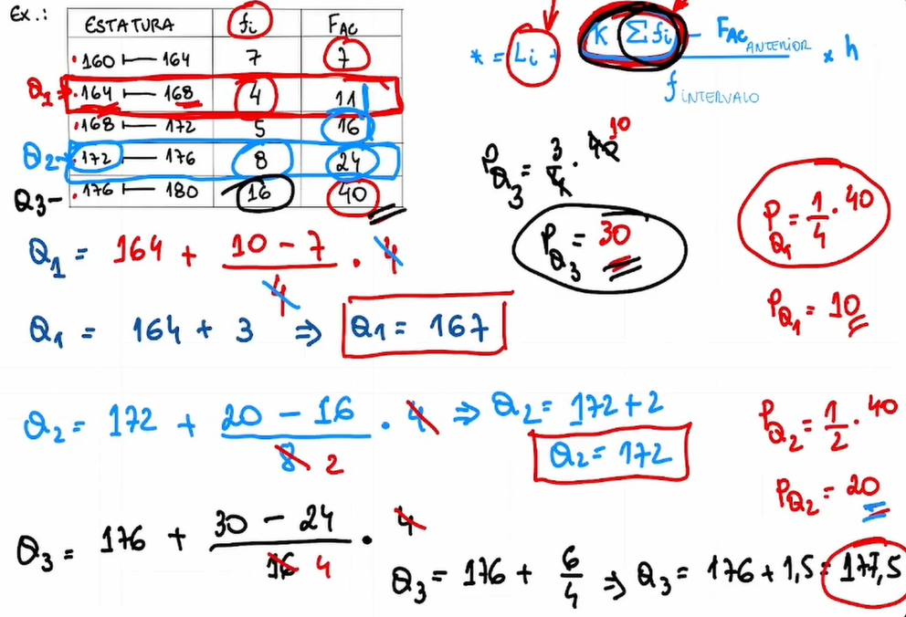
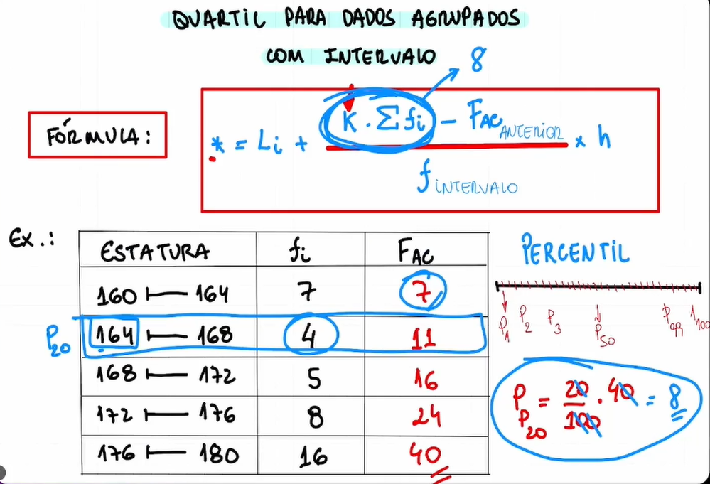
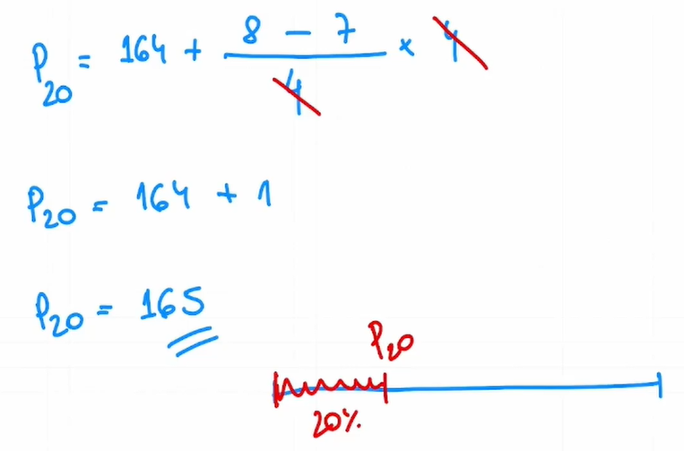
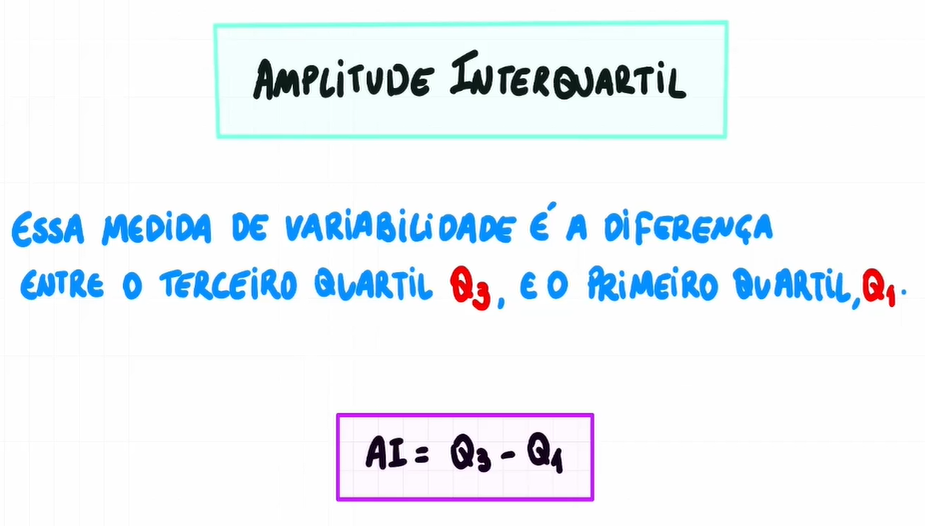
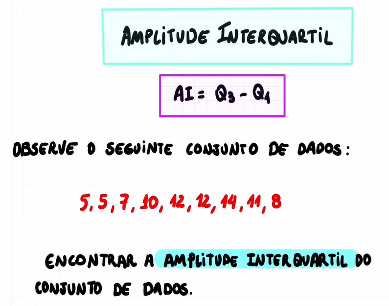
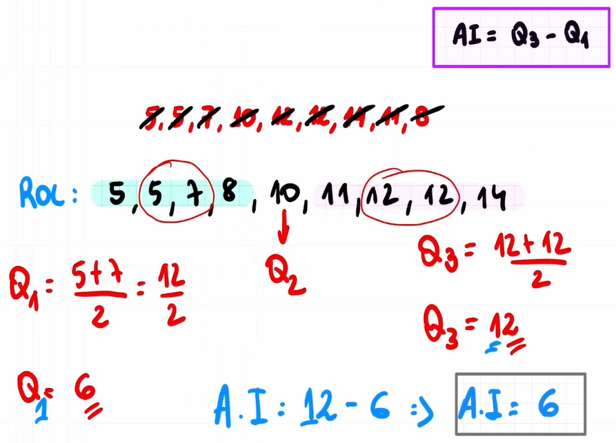
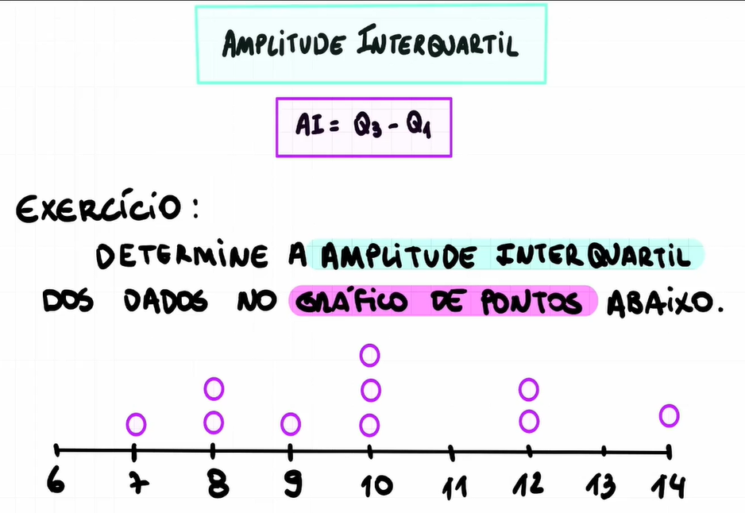
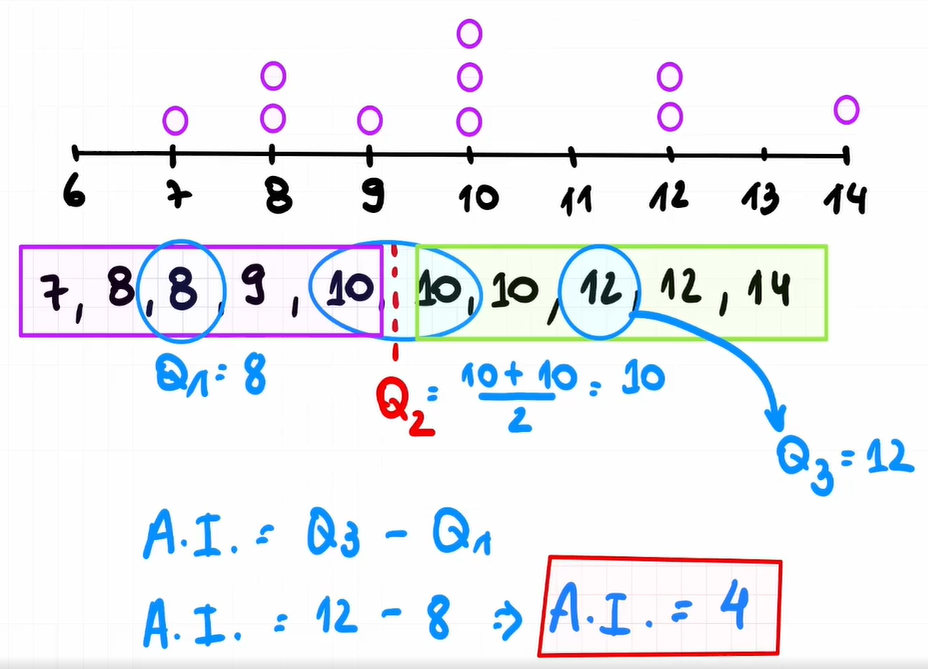

# Medidas de posição

## Quartis



## Quartil Intervalo





## Percentil




## Amplitude interquartil





## Amplitude interquartil: Exercício




Exercício - Resposta:

```
  7, 8, 8, 9, 10, 10, 10, 12, 12, 14

  q1 = 8

  q2 = 10 + 10 / 2
  q2 = 20 / 2
  q2 = 10

  q3 = 12

  ai = 12 - 8
  ai = 4
```

## Gráfico BoxPlot


