# Análise combinatória e probabilidade

## PFC

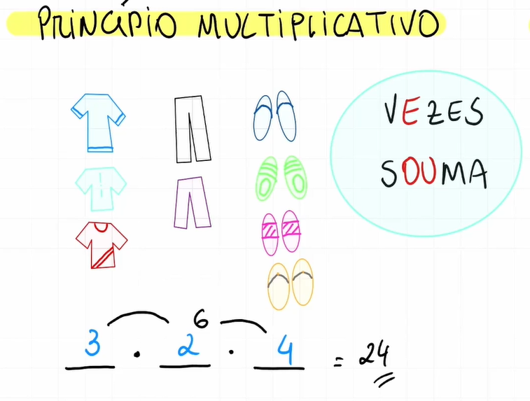
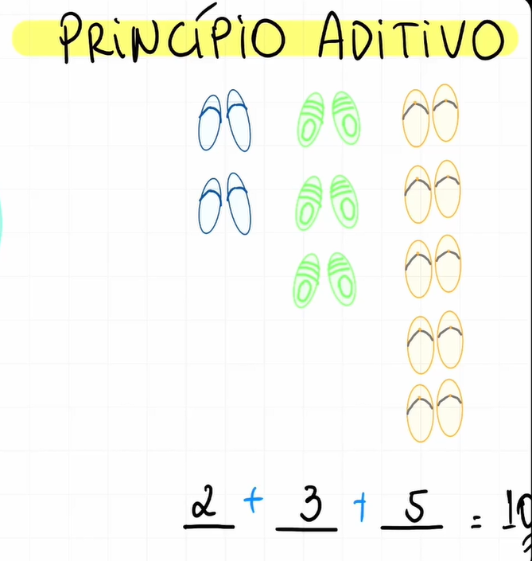
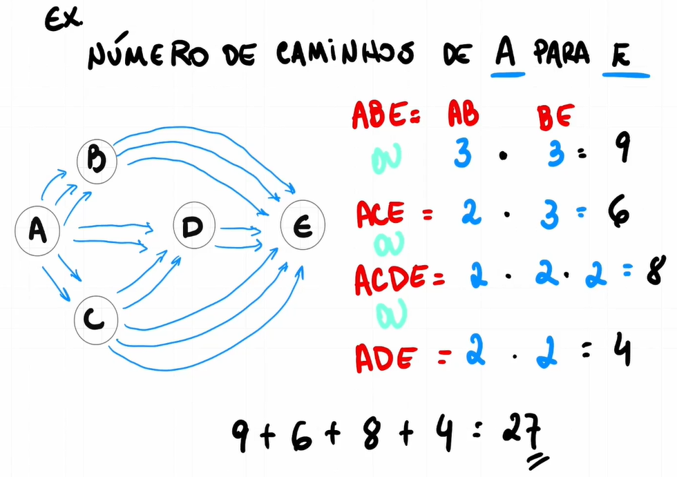

## Fatorial


## Permutação simples

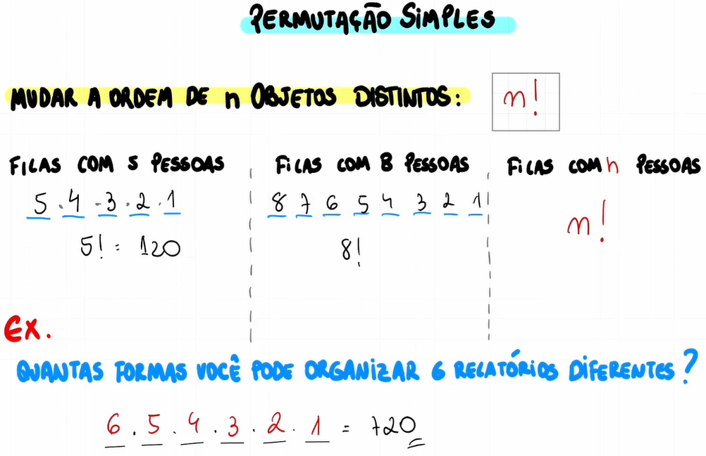

## Arranjo simples

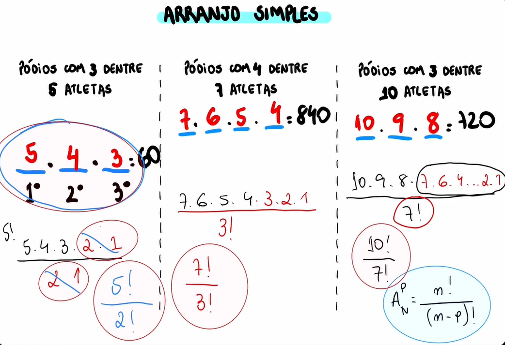

## Combinação simples

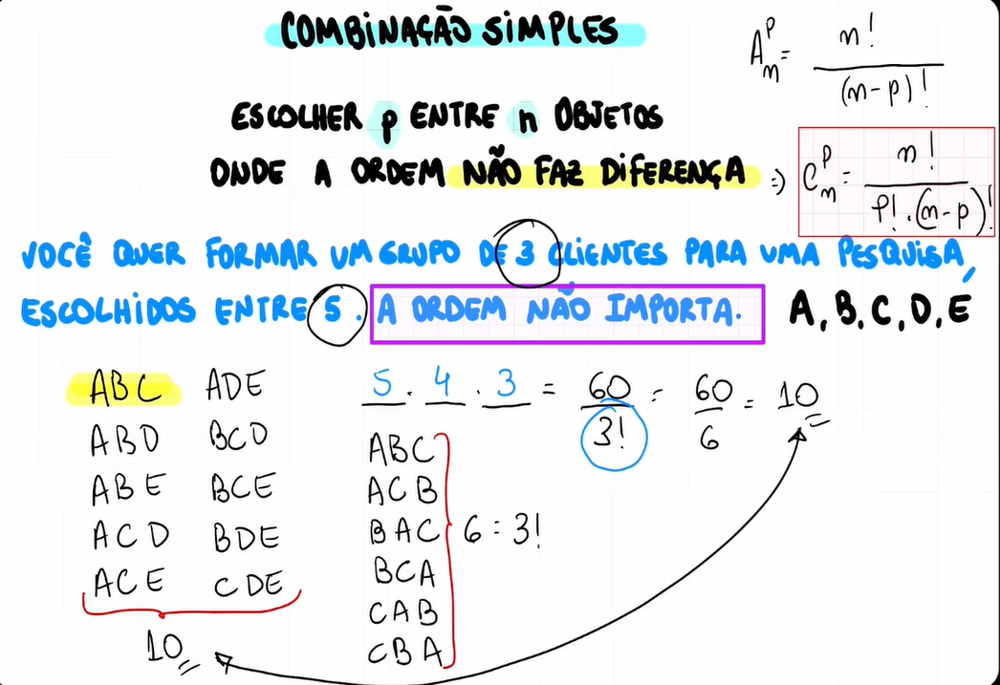


## Contextualização


## Espaço amostral e evento

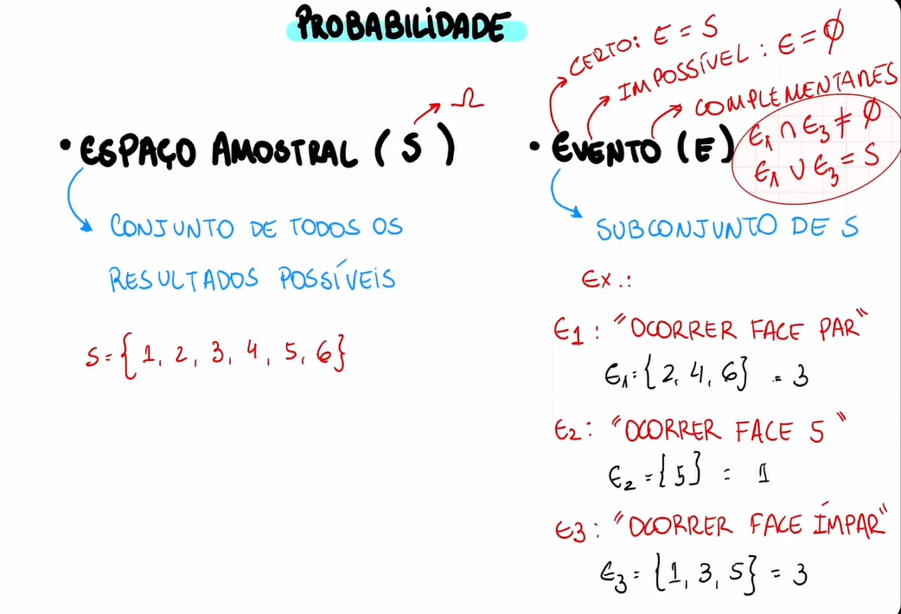

## Probabilidade

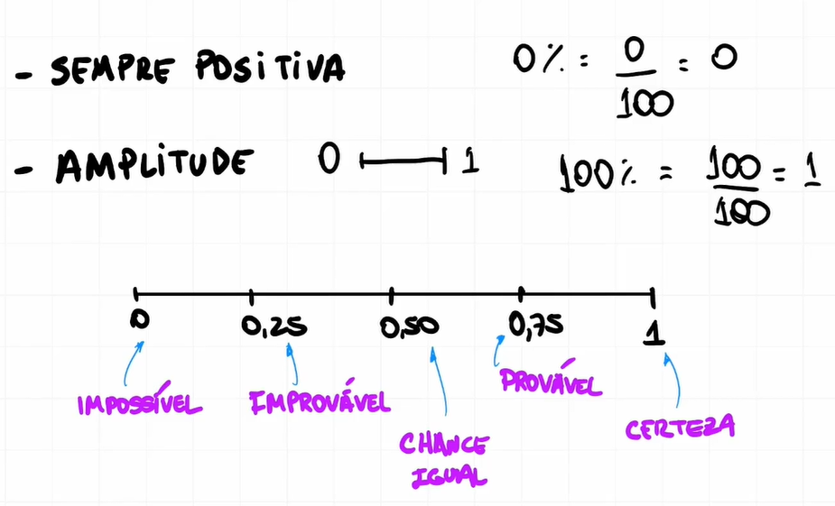
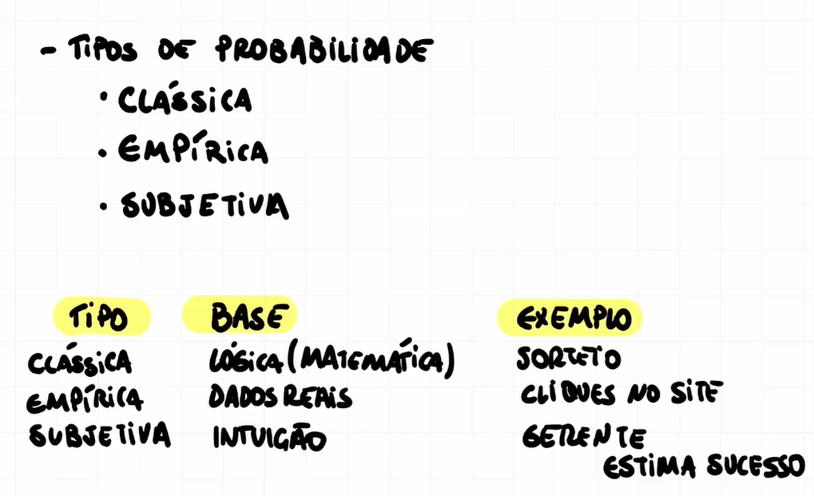
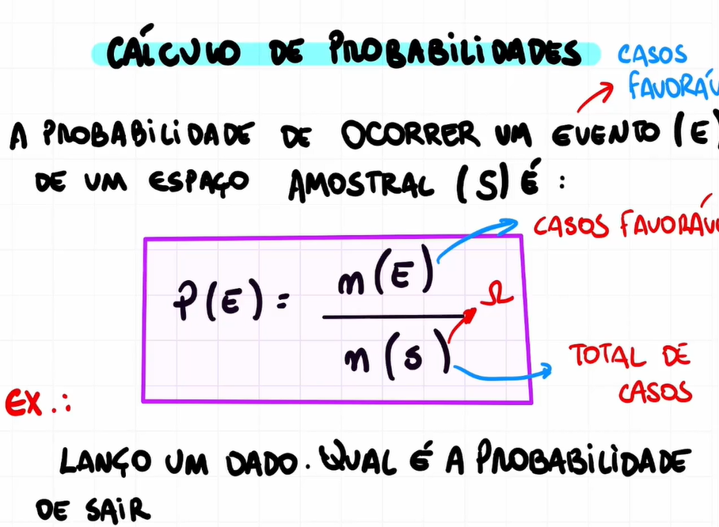
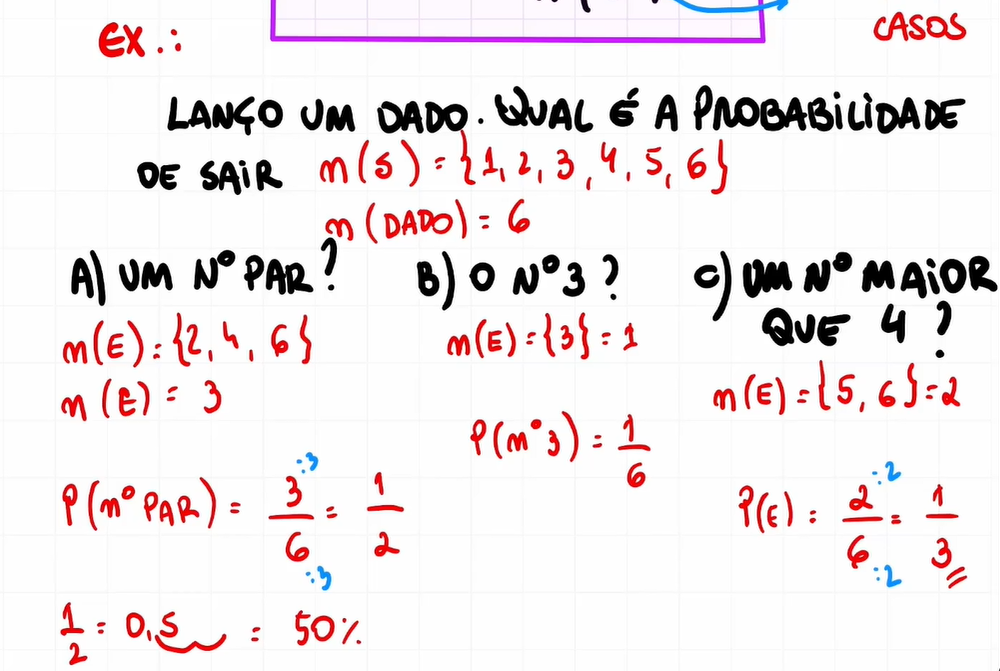

## Probabilidade - Exercício


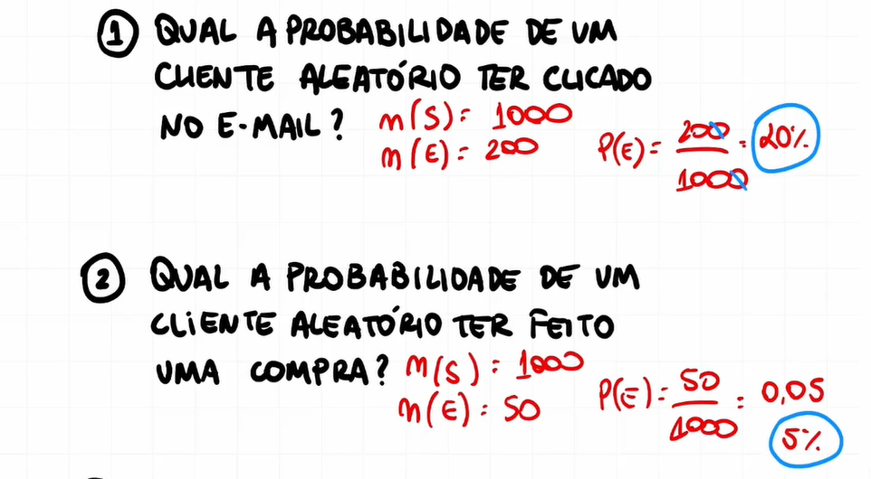
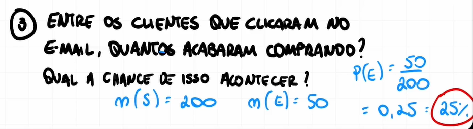

<!--  -->

Exercício 1 - Resposta:

```
  n(s) = 1000
  n(e) = 200

  p(e) = 200 / 1000
  p(e) = 0,20
  p(e) = 20%
```

Exercício 2 - Resposta:

```
  n(s) = 1000
  n(e) = 50

  p(e) = 50 / 1000
  p(e) = 0,05
  p(e) = 5%
```

Exercício 3 - Resposta:

```
  n(s) = 200
  n(e) = 50

  p(e) = 50 / 200
  p(e) = 0,25
  p(e) = 25%
```

## Probabilidade condicional

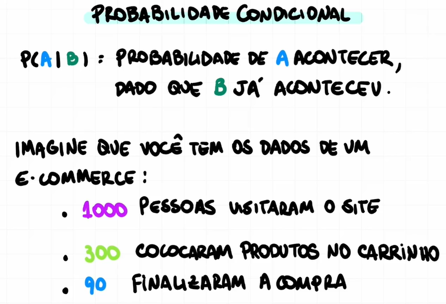
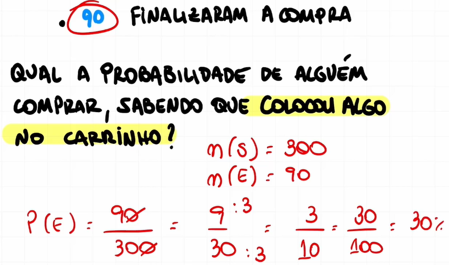


