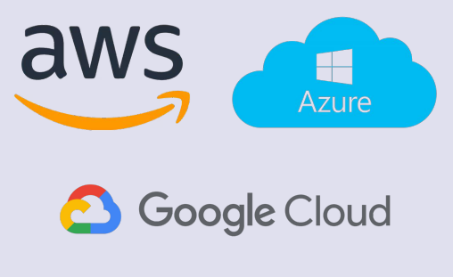
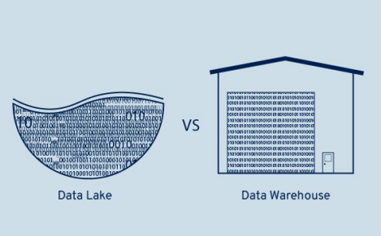

# Fundamentos de cloud e armazenamento de dados

## Por que um analista de dados precisa entender cloud?

- A nuvem é o novo padrão de armazenamento de dados.
- Permite escalar projetos, acessar dados de qualquer lugar e integrar com BI e programação.
- BigQuery e AzureSQL são comuns no dia a dia do analista.

## O que é computação em nuvem?

- SaaS (Software as a Service): Software pronto via navegador. Ex: Google Drive, Power BI Online.
- PaaS (Platform as a Service): Plataforma para desenvolver e hospedar aplicativos. Ex: Google App Engine, Azure Functions.
- IaaS (Infrastructure as a Service): Infraestrutura de servidores, redes e armazenamento. Ex: AWS EC2, Google Compute Engine.

## Principais provedores de nuvem



## Como os dados são armazenados?



## Como acessar dados na nuvem?

```python
from google.cloud import bigquery
client = bigquery.Client()
query = "SELECT * FROM dataset.tabela"
df = client.query(query).to_dataframe()
```

## GCP

[Google Cloud](https://cloud.google.com/)