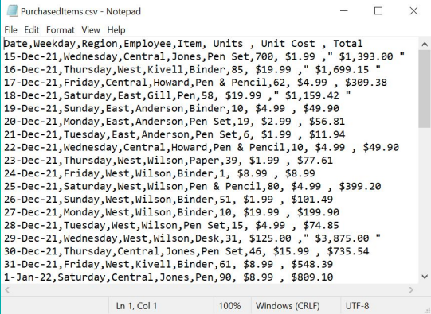
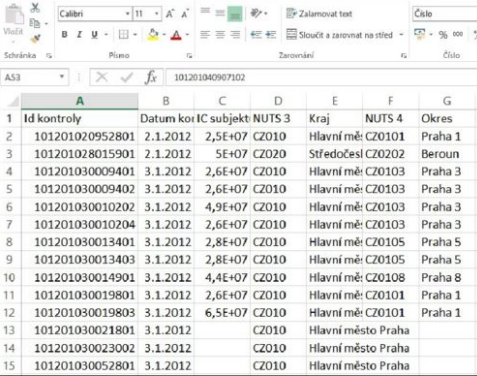

# CSV, Excel e o que significa ler um dado

## O que é um arquivo de dados?

É um arquivo que armazena informações organizadas de forma digital. Esses formatos são usados para troca, armazenamento e análise de dados.

Exemplos:

- Tabela de clientes em Excel
- Lista de compras em CSV
- Dados de API em JSON

## O que é um CSV?

CSV = Comma-Separated Values (valores separados por vírgula)

- Arquivo de texto simples
- Cada linha representa um registro
- Colunas separadas por vírgula, ponto e vírgula ou outro separador



## O que é um XLSX (Excel)?

- Formato nativo de planilhas do Excel
- Suporta múltiplas abas, fórmulas, estilos
- Mais pesado e complexo que CSV
- Não é ideal para automações, mas ótimo para visualização manual



## O que é um JSON?

JSON = JavaScript Object Notation

- Formato usado em APIs e dados estruturados em chave-valor
- Pode representar dados mais complexos (listas dentro de listas)

Exemplo:

```JSON
{
  "nome": "Ana",
  "idade": 34,
  "compras": ["calça", "camisa"]
}
```

## Partes de um CSV


