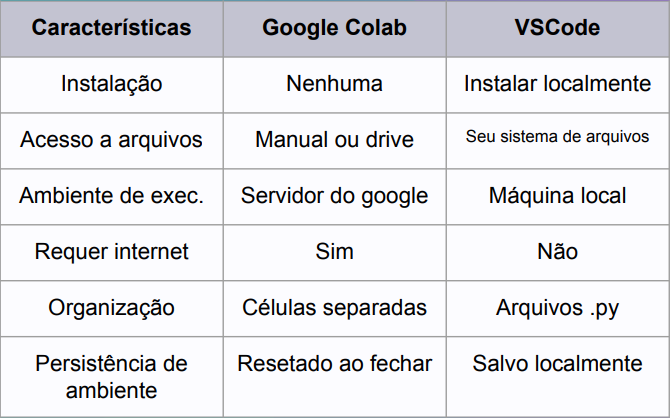
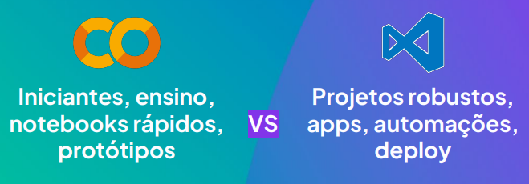

# Começando com Python no Google Colab

## O que é o Google Colab?

Google Colab é uma ferramenta gratuita do Google para escrever e executar código Python diretamente no navegador.

Vantagens:

- Não precisa instalar nada
- Usa servidores do Google (mais rápido)
- Ideal para notebooks de dados e ensino

## Google Colab vs VSCode




## O que é um notebook?

É um documento interativo que mistura:

- Células de código (executável)
- Células de texto (explicações)
- Resultados (tabelas, gráficos, saídas)

Perfeito para contar uma história com dados!

## Rodando células de código

Você pode escrever e executar código Python célula por célula

Exemplo:

```python
print("Olá, mundo!")
```

Use **Shift+Enter** para rodar a célula selecionada.

## Células de texto (Markdown)

Use texto para explicar seu raciocínio no notebook.

Exemplo de markdown:

```markdown
# Título grande

## Título menor

- Lista de itens
```

## Subindo arquivos no Colab

Para trabalhar com bases de dados, você pode:

- Usar o botão de upload de arquivo
- Conectar com o Google Drive
- Usar códigos

## Boas práticas no Google Colab

- Comentar o código
- Separar seções com texto
- Nomear variáveis com clareza
- Salvar versões importantes no Drive
- Reiniciar o runtime se der erro estranho
