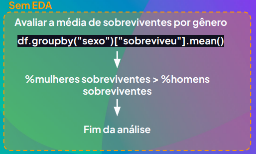
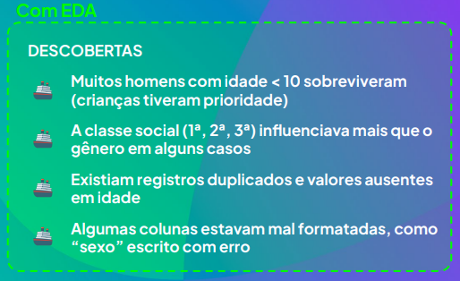
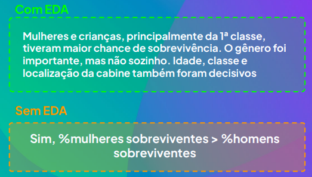

# O que é EDA

## O que é EDA (Exploratory Data Analysis)?

- EDA é o momento de explorar os dados com curiosidade
- É quando buscamos padrões, comportamentos e possíveis problemas
- Serve para fazer perguntas inteligentes antes de aplicar modelos ou conclusões

## Como fazer o EDA?

- O que os dados estão tentando me dizer?
- Tem algo estranho aqui?
- Existem grupos ou exceções?
- O que eu ainda não percebi?
- Quais colunas têm maior variabilidade?
- Existe relação entre duas variáveis?
- Existem outliers?

## E como um bom EDA muda tudo?

### O fator gênero influenciou a chance de sobrevivência no titanic?

- Evita análises rasas ou enviesadas
- Ajuda a formar hipóteses mais completas
- Traz à tona informações invisíveis à primeira vista
- Te salva de errar ou comunicar mal uma descoberta

## Conclusão

- EDA é a fase da descoberta em dados
- Te ajuda a ver o que vale a pena tratar, filtrar, modelar
- Mais do que números, ela exige olhar atento e crítico

## Exercício de EDA

Filmes mais longos e antigos tendem a ter melhores avaliações?

Objetivo: Usar Análise Exploratória de Dados (EDA) para levantar hipóteses.

[Base de Dados](https://drive.google.com/file/d/15C5h11Z8bt9lfCJjQZfa6W527sGjY4p4/view)
