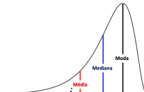

# Média, mediana e moda

## O que é a média?

- Soma de todos os valores dividida pelo total de elementos
- Usada para representar o "valor típico"

Exemplo:

Notas: 6, 7, 8 → Média = (6+7+8)/3 = 7.0

## O que é a mediana?

- Valor que fica no meio da distribuição, quando ordenada
- Menos sensível a valores extremos (outliers)

Exemplo:

Notas: 3, 6, 7, 8, 10 → Mediana = 7

## O que é a moda?

- Valor que mais se repete em um conjunto
- Útil para dados categóricos ou padrões repetitivos

Exemplo:

Notas: 6, 7, 7, 8 → Moda = 7

## Quando usar cada uma?

- Média: quando os dados estão bem distribuídos (sem extremos)
- Mediana: quando há outliers ou distribuição muito desigual
- Moda: quando queremos o valor mais comum (categorias, preferências)

### Exemplo 1 - Salário

### Exemplo 2 - Desempenho escolar

### Exemplo 3 - Tempo de espera

## Se a mediana é tão resistente a outliers... por que não usá-la sempre?

Porque ela nem sempre representa bem o “todo” — só o valor central.

## Limitações da mediana:

1. Ela ignora o restante dos dados

A mediana só olha o valor do meio (ou média de dois valores centrais). Não considera como o restante está distribuído

[10, 10, 10, 90, 90] → mediana = 10

2. Não pode ser usada para cálculos agregados

Você não consegue fazer: "a soma das medianas". Média é fundamental em indicadores como: média de lucro, nota média, média de temperatura

O lucro médio por loja foi R$ 12.250 → você pode multiplicar isso pelo número de lojas e estimar o total

3. Mediana não serve para análise de variação

Se você quiser saber se os dados estão dispersos, a média é melhor para aplicar desvio padrão,variância etc.

4. Pouco intuitiva em grandes distribuições simétricas

Se os dados forem bem distribuídos, a média resume melhor o comportamento geral

## Conclusão

- Média, mediana e moda ajudam a resumir dados
- Cada uma serve para contextos diferentes
- Uma boa análise sabe quando usar cada uma
- Muitas vezes é necessário tratar outlier antes
