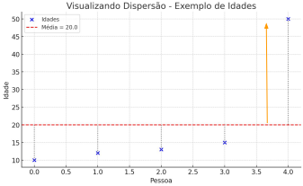
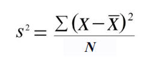

# Variância e desvio padrão

## O que é dispersão?

- Dispersão = o quanto os dados estão espalhados
- Mesmo com a mesma média, os dados podem estar mais próximos ou mais distantes entre si.

🎯 Medidas de dispersão mostram a confiabilidade da média.

## Analogia simples: caixas de notas

- Imagine duas turmas com média 7

Turma A: 6, 7, 7, 8, 7 → notas próximas

Turma B: 0, 2, 7, 10, 10 → notas espalhadas

- A média é a mesma, mas a realidade é bem diferente!

## O que é variância?

Variância mede o quanto os dados estão espalhados em relação à média.

Imagine que você borrifa um perfume no elevador:

- Se o perfume ficar concentrado num canto → pouca dispersão

- Se o perfume se espalhar pelo elevador todo → grande dispersão

Isso é a variância: mostra o quanto os valores "se espalham".

### Como funciona?

Idades de uma turma: 10, 12, 13, 15, 50

Média: 20



Os desvios são grandes, por causa do 50. A variância será alta.

1. Pega a média dos dados
2. Vê o quanto cada valor se afasta da média
3. Eleva ao quadrado cada desvio (pra não dar negativo)
4. Tira a média disso



### Exemplo variância

Conjunto de dados: [10, 12, 13, 15, 50]

1. Pega a média dos dados

x = 20
N = 5

2. Vê o quanto cada valor se afasta da média

x1 - x̅ = 10 - 20 = -10
x2 - x̅ = 12 - 20 = -8
x3 - x̅ = 13 - 20 = -7
x4 - x̅ = 15 - 20 = -5
x5 - x̅ = 50 - 20 = 30

3. Vê o quanto cada valor se afasta da média

x1 - x̅ = 10 - 20 = -10 (desvio de x1)
x2 - x̅ = 12 - 20 = -8 (desvio de x2)
x3 - x̅ = 13 - 20 = -7 (desvio de x3)
x4 - x̅ = 15 - 20 = -5 (desvio de x4)
x5 - x̅ = 50 - 20 = 30 (desvio de x5)

4. Vê o quanto cada valor se afasta da média

(x1 - x̅)² = 100
(x2 - x̅ )² = 64
(x3 - x̅)² = 49
(x4 - x̅)² = 25
(x5 - x̅)² = 900

5. Vê o quanto cada valor se afasta da média

(x1 - x̅)² = 100 +
(x2 - x̅ )² = 64 +
(x3 - x̅)² = 49 +
(x4 - x̅)² = 25 +
(x5 - x̅)² = 900
∑(x-x̅)² = 1138

6. Tira a média disso

s² = 1138/5 = 227 = variância

7. Como saber se a variância está alta?

s² >>x̅
227 > 20

## E o desvio padrão?

Desvio padrão é a raiz quadrada da variância.

Ele diz: “em média, o quanto os dados se desviam da média”.

s = √s²
s = √227 = 15

Conjunto de dados: [10, 12, 13, 15, 50]

Dev pad = s = √227 = 15
média = x̅ = 20

Como o desvio padrão (15) é 75% da média (20), a dispersão é alta. A média não representa bem o grupo nesse caso.

### Conclusão

O desvio padrão não se avalia sozinho.

Você precisa sempre comparar com a média ou com outros grupos para entender o que ele diz sobre os dados.

## A variância se torna mais útil quando comparada entre grupos

Turma A: 6, 7, 7, 8, 7 → notas próximas
Turma B: 0, 2, 7, 10, 10 → notas espalhadas

📊 Exemplo:
Turma A: média = 7, desvio padrão = 1
Turma B: média = 7, desvio padrão = 4
➡ Ambas têm a mesma média, mas a Turma B tem desempenho mais irregular.

## E vou precisar fazer todo esse cálculo?

Cálculo de Variância:

```python
df['coluna'].var()
Excel = VAR.P()
```

Cálculo do Desvio Padrão:

```python
df['coluna'].std()
Excel = DESVPAD()
```
