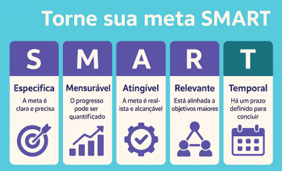

# Transformando metas em indicadores com impacto

## O que não é medido, não é gerenciado

Exemplos ruins:

- “Quero melhorar o engajamento”
- “Quero aumentar a receita”
- “Quero melhorar o atendimento”

## De meta vaga para indicador SMART

Caso:

- 🗣 Meta vaga: “Melhorar a retenção de clientes”
- ✅ Meta SMART: “Reduzir o churn mensal de 10% para 5% até dezembro”
- 📊 KPI gerado: Churn Rate

## Como sair de uma meta e chegar num KPI

Mini framework:

1. Qual o objetivo?
2. Qual o resultado esperado?
3. O que pode ser medido nesse caminho?
4. Esse indicador leva a uma ação?

## Exercício prático

🎯 Meta: “Aumentar a conversão no site”

1. Específica?
2. Mensurável?
3. Relevante para quem?
4. Até quando?
5. Qual o KPI ideal?

## Exercício prático

- ✅ Meta SMART: “Aumentar a taxa de conversão do site de 2% para 4% até o fim do trimestre”
- 📊 KPI: Taxa de Conversão (Vendas / Visitas)

## Conclusão

- ☑ É específica?
- ☑ Pode ser medida com dados reais?
- ☑ Está ligada a uma ação concreta?
- ☑ Existe um prazo?
- ☑ Gera um KPI útil?
