# Distribuições estatísticas na prática - Parte 1

# O que são distribuições?

Distribuições são o jeito da estatística te mostrar como os dados se comportam.

Uma distribuição mostra quantas vezes cada valor aparece. É como contar quantas pessoas têm cada altura em uma turma. Isso já te dá uma ideia do ‘formato’ dos dados.

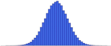

## Por que distribuições são importantes?

1. Escolher testes estatísticos adequados
2. Simular cenários realistas
3. Calcular probabilidades corretas
4. Evitar alarmes falsos ou conclusões erradas

## Distribuição Normal: a curva do sino

Ela aparece em quase tudo: salários, alturas, notas, tempos de entrega…

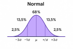

- 📍 A maioria dos dados está no meio
- 📉 Poucos dados nos extremos
- 📏 É simétrica

Impacto no output:

- → Você pode usar z-score, intervalo de confiança, testes t
- → Se os dados forem assim, você pode generalizar melhor suas conclusões para a população

- 🧒 Altura de pessoas
- 📝 Notas de provas
- 💰 Salários em empresas grandes

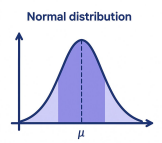

Fórmula de densidade:

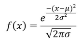
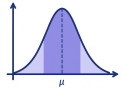

- x → o valor que você quer saber a probabilidade de aparecer
- μ → a média dos dados (onde a curva é mais alta)
- σ → o desvio padrão (o quanto os dados estão espalhados)
- e → número de Euler (~2,718), aparece porque estamos lidando com crescimento natural

## O que é uma função de densidade?

Uma função de densidade (ou função densidade de probabilidade, FDP) é o jeito matemático de responder:

“Quão provável é encontrar um valor próximo de 𝑥 nesse conjunto de dados?”

Ela não te dá a probabilidade de um valor exato (como "qual a chance de alguém ter exatamente 1,73m"), mas sim:

“Qual a chance de estar entre 1,72m e 1,74m?”

Ou seja: quanto mais alta a curva, mais provável os dados estarem ali perto.

🎯 Resumindo: A função de densidade desenha a “curva” dos seus dados contínuos e ela mostra onde os dados se concentram

# 68−95−99: regra da curva normal

Imagine que você está medindo altura de pessoas em uma empresa, e a média é 1,70 m com desvio padrão de 0,10 m. A régua da curva vai te dizer o seguinte:

- 🟢 1 desvio padrão da média (±1σ)
  Intervalo: de 1,60 m a 1,80 m
  Cobertura: ≈ 68% das pessoas
- 🟡 2 desvios padrão da média (±2σ)
  Intervalo: de 1,50 m a 1,90 m
  Cobertura: ≈ 95% das pessoas
- 🔴 3 desvios padrão da média (±3σ)
  Intervalo: de 1,40 m a 2,00 m
  Cobertura: ≈ 99,7% das pessoas

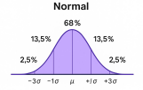

## Dist. Exponencial: o tempo entre eventos

Quanto tempo demora até algo acontecer. Não é simétrica, ela ‘cauda’ pro lado.

- 📉 Queda rápida
- ⏳ Muitos casos com pouco tempo
- 🔁 Alguns casos demoram muito

## Dist. Exponencial: o tempo entre eventos

- 🕒 Tempo entre chamadas num call center
- 💻 Tempo até um clique no site
- 🧾 Tempo até o próximo pedido de compra

## Dist. Exponencial: o tempo entre eventos

Fórmula de densidade:

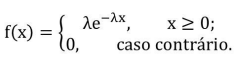
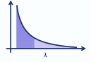

- x → o tempo até o próximo evento acontecer
- λ → a taxa de ocorrência média por unidade de tempo
- e −λx → controla o quanto a probabilidade decai com o tempo

## Dist. Poisson: contando eventos raros

A Poisson é usada quando você quer saber quantas vezes uma coisa vai acontecer em certo intervalo de tempo ou espaço

- 💡 Quantos carros passam por um pedágio em 1 hora?
- 📦 Quantos pedidos chegam por minuto?
- 📢 Quantos comentários em um post por hora?
- 🔢 Números inteiros (0, 1, 2, 3...)
- 📦 Eventos independentes
- 📏 Foco em volume dentro de janelas fixas

Impacto no output:

- → Testes como Qui-quadrado ou Poisson são mais indicados
- → Se você aplicar modelo normal aqui, vai subestimar outliers, ignorar zeros e pode gerar insights falsos

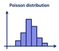

Fórmula de densidade:

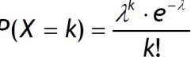
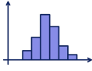

- k → número de eventos que você quer calcular (ex: 2 chamadas por minuto)
- λ → número médio de eventos por intervalo (ex: média de 5 chamadas por minuto)
- e −λ → ajusta a distribuição para que a soma das probabilidades = 1
- λ k → a taxa elevada ao número de eventos
- k! → o fatorial do número de eventos (fator de “peso” da ocorrência)

## Comparativo das distribuições

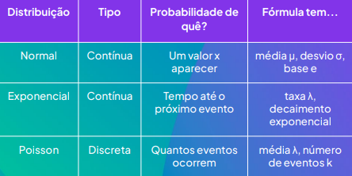

## Como reconhecer a distribuição?

- 📈 Plote o histograma
- 🔎 Veja se é simétrica
- ⏳ Repare no contexto (tempo, contagem, proporção?)

## Desafio

Qual distribuição você usaria?

- Cenário 1: Tempo até o próximo pedido
- Cenário 2: Quantidade de acessos por minuto
- Cenário 3: Tempo que uma pessoa gasta no site
