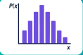
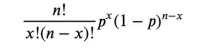
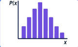
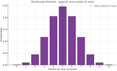
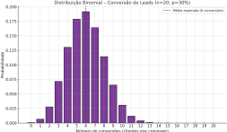
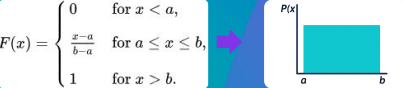

# Distribuições estatísticas na prática - Parte 2

## Distribuição Binomial

Ela responde a pergunta: quantas vezes algo dá certo em várias tentativas?

- Conversão de leads (quantos compram?)
- Emails abertos (quantos clicam?)
- Testes A/B (quantos convertem?)

- ✅ Útil para prever quantos sucessos esperar em uma campanha
- ❌ Se você tratar esses dados como normais, vai errar intervalos de confiança

Fórmula de densidade:

- 𝑛 → número de tentativas
- 𝑝→ probabilidade de sucesso
- x→ número de sucessos desejados

### Exemplo 1

Você joga uma moeda 10 vezes e quer saber:

“Qual a chance de cair exatamente 0, 1, 2, ..., até 10 caras?”

O gráfico da distribuição binomial tem no eixo:

- Eixo X (horizontal): Número de caras (de 0 a 10)
- Eixo Y (vertical): Probabilidade de cada quantidade acontecer
- Cada barra mostra a chance de obter aquele número exato de caras em 10 lançamentos.

📌 O formato do gráfico fica parecido com a curva normal quando o número de tentativas é maior e a probabilidade é equilibrada (p ≈ 0,5).

## Exemplo 2

Você tem 20 leads e quer saber:

“Qual a chance de exatamente 0, 1, 2, ..., até 20 pessoas converterem (comprarem)?”

O gráfico da distribuição binomial tem no eixo:

- Eixo X (horizontal): Número de conversões (de 0 a 20)
- Eixo Y (vertical): Probabilidade de cada quantidade acontecer
- A curva mostra que o número mais provável de clientes que vão comprar está entre 4 e 8, com o pico da distribuição em 6 conversões, que é a média esperada para uma taxa de conversão de 30%.

## Distribuição Uniforme

Todos os valores dentro do intervalo têm a mesma chance de acontecer.

- 🛠 Simulações
- 📊 Geração de números aleatórios
- 📦 Estoques com rotatividade similar

- ✔ Ajuda a simular cenários
- ✔ Útil para modelos de incerteza
- ❌ Se você usar média como preditor, pode perder o comportamento plano

Fórmula de densidade:

a: valor mínimo
b: valor máximo

## Distribuição Gama

Ela modela o tempo total até que vários eventos independentes aconteçam.

- 🧪 Tempo até a 5ª falha de um sistema
- 🧪 Tempo total que um cliente passa em uma plataforma até churn

Quando usar?

- 📍 Quando você precisa modelar duração acumulada
- 📍 Para falhas, tempo total de espera, risco acumulado

Fórmula de densidade:

α: número de eventos (forma)
𝛽: escala (tempo médio entre eventos)

### Exemplo 1

Imagine que você monitora a estabilidade de um servidor. Em média, ocorre 1 falha a cada 2 dias. Agora você quer saber:

“Qual a chance de que a 3ª falha ocorra em até 6 dias?”

- Eixo X (horizontal): Tempo total até ocorrerem os eventos (ex: dias até a 3ª falha)
- Eixo Y (vertical): Densidade de probabilidade — onde o tempo mais provável está concentrado

A curva da Gama começa baixa, sobe e depois cai:

● Sobe porque os primeiros tempos são muito curtos
● Cai porque tempos muito longos são improváveis
● O pico mostra o tempo total mais provável para que 3 eventos ocorram

### Exemplo 2

O cliente realiza, em média, 4 ações antes de abandonar e o tempo médio entre cada ação é de 1,5 dia.

“Quanto tempo um cliente permanece usando um app antes de abandonar?”

Interpretação:

● Resultado: o tempo médio total de uso é de 6 dias (linha pontilhada).
● A probabilidade de um cliente abandonar o app até o 6º dia é de aproximadamente 56,65%
● A curva mostra que abandonar antes de 2 dias é raro, e que a maior parte dos clientes abandona entre 4 e 8 dias.

## Comparativo final

## Você não precisa decorar fórmulas

Mas precisa entender:

- Quando a curva é simétrica, ou não
- Quando os dados são contagem, tempo ou medidas contínuas
- O que é normal — e o que é exceção
