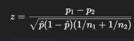
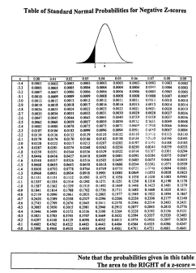

# Explicando valor -p

## O que é valor-p?

Valor-p é a probabilidade de obter um resultado tão extremo quanto o que você viu, assumindo que a hipótese nula é verdadeira.

É uma medida de surpresa: quanto menor o valor-p, mais estranho seria ver aquele dado se H₀ fosse verdadeira.

- Imagine jogar uma moeda 100 vezes. Esperamos 50% cara.
- Se der 52% cara, ok. Mas se der 90%?

O valor-p mede quanto o que você viu é improvável.

Quanto menor o valor-p, mais incomum seria observar o H0

90% de cara seria muito improvável, então p-value seria muito pequeno

## Entendendo na prática

Imagine um julgamento. Um réu está sendo acusado de um crime.

Você é o jurado. Seu trabalho é decidir, com base nas evidências, se a pessoa deve ser considerada culpada ou inocente.

O valor-p é como a força das evidências apresentadas no tribunal contra o réu.

Se o valor-p for ALTO (ex: 0,6):

- ● As evidências são fracas.
- ● Você pensa: “Esses argumentos não são suficientes para condenar.”

👉 Veredito: Inocente (não rejeitamos H₀)

Se o valor-p for MUITO BAIXO (ex: 0,01):

- ● As evidências são fortes e raras de ver por acaso.
- ● Você pensa: “Seria muito improvável ver isso se ele fosse inocente.”

👉 Veredito: Culpado (rejeitamos H₀)

## Nível de significância

O nível de significância é o limite que você define antes do teste para decidir quando um valor-p é considerado pequeno o suficiente para rejeitar a hipótese nula (H₀).

É o quanto de risco de erro você está disposto a aceitar ao dizer que há um efeito.

O valor mais comum é α = 0,05 (ou seja, 5% de tolerância para errar).

## Aplicando as hipóteses

A empresa lançou uma nova campanha e quer saber se a taxa de conversão aumentou.

- ➔ H₀ (hipótese nula): A taxa de conversão da nova campanha é igual à da anterior.
- ➔ H₁ (hipótese alternativa): A nova campanha aumentou a taxa de conversão.

Resultado do teste: valor-p = 0,02

- ➔ Como 0,02 < 0,05, temos evidência estatística moderada contra H₀.
- ➔ Rejeitamos H₀: é provável que a nova campanha tenha realmente aumentado a conversão.

## Exemplo prático: campanha de marketing

Campanha A: 4% conversão, Campanha B: 6%

Será que essa diferença é por sorte ou real?

- ➔ H0: A taxa de conversão da Campanha A é igual à da Campanha B.
- ➔ H1: A taxa de conversão da Campanha A é diferente da Campanha B.

Se valor-p < 0,05, isso significa que seria muito raro observar essa diferença de 2 pontos percentuais por acaso, assumindo que H₀ é verdadeira.

Rejeitamos H0

## Como calcular o valor-p?

Defina suas hipóteses

- ● H₀: as taxas de conversão são iguais
- ● H₁: as taxas de conversão são diferentes

Escolha o teste estatístico apropriado

Como estamos comparando duas proporções, o teste certo é o teste z para proporções.

Aplique a fórmula apropriada

valor-p = 2⋅P(Z <− p) (para o caso de bicaudal com proporção)

CENÁRIO

- ● Campanha A: 4% conversão (40 de 1.000 pessoas)
- ● Campanha B: 6% conversão (60 de 1.000 pessoas)
- ● Pergunta: Essa diferença de 2 pontos percentuais é real ou pode ter sido sorte?

PASSO 1: Definir as hipóteses

- ● H₀: As taxas de conversão são iguais
- ● H₁: As taxas de conversão são diferentes

PASSO 2: Escolher o teste estatístico

-● Comparando duas proporções, usamos o teste Z para duas proporções

PASSO 3: Calcular o valor-p

1. Proporções:

- ● p₁ = 0,04 (Campanha A)
- ● p₂ = 0,06 (Campanha B)
- ● p̂ (proporção combinada) = (40 + 60) / (1000 + 1000) = 0,05

2. Fórmula do teste Z:

Z e valor-p estão conectados:

O valor-p é a área sob a curva normal que corresponde ao Z. Quanto mais extremo for o Z, menor será o valor-p, e mais evidência teremos contra H₀.

PASSO 4: Encontrar o valor-p

- ● Como é um teste bicaudal, olhamos a área de duas caudas.
- ● Para z = -2,89 → valor-p ≈ 0,0039
- ● O valor de Z mostra quantos desvios padrão a diferença observada entre os grupos está afastada da hipótese nula (H₀).

CONCLUSÃO

- ● Como valor-p = 0,0039 < 0,05, rejeitamos H₀.
- ● A diferença entre as campanhas provavelmente não foi por acaso.

INTERPRETAÇÃO

- ➔ O Z = -2,05 indica que essa diferença está a 2,05 desvios padrão de distância do que seria esperado se não houvesse diferença real.
- ➔ Com menos de 0,4% de chance de ver uma diferença tão grande só por sorte, temos evidência forte de que a Campanha B é melhor.

## Erro tipo I e tipo II

- ● Erro tipo I (α) → Você conclui que há um efeito, mas era só sorte.
  Ex: Concluir que uma campanha funcionou quando não funcionou.
- ● Erro tipo II (β) → Você acha que não tem efeito, mas ele existe.
  Ex: Perder uma campanha ótima por não ver o efeito.

O valor-p está ligado ao erro tipo I:

Se você define α = 0,05, está aceitando errar 5 vezes em 100 mesmo se H₀ for verdadeira.

## Interpretando criticamente o valor-p

O que o valor-p realmente mostra:

A probabilidade de observar os dados (ou algo mais extremo), assumindo que H₀ é verdadeira.

É uma medida de evidência contra a hipótese nula, não uma prova absoluta.

O que o valor-p não mostra:

- ❌ Não é a chance da hipótese nula estar errada. (Valor-p ≠ probabilidade de H₀ ser falsa)
- ❌ Não é o tamanho do efeito.
- ❌ Não é garantia de replicabilidade.

Decisões importantes não devem se basear só em valor-p.

## Exemplo: Treinamento de pessoas

Objetivo: Avaliar se o novo treinamento aumentou a nota média no teste final.

- ● 10 colaboradores
- ● Notas antes do treinamento: [68, 72, 70, 75, 65, 80, 69, 74, 71, 73]
- ● Notas depois do treinamento: [72, 76, 74, 79, 69, 82, 70, 78, 75, 76]

H₀: A média das notas dos colaboradores não mudou após o treinamento.
H₁: A média das notas aumentou após o treinamento.
Teste estatístico: Teste T pareado (antes e depois)

Valor-p: 0,081
Conclusão: Como 0,081 > 0,05 → Não rejeitamos H₀.

Não há evidência suficiente para afirmar que o treinamento aumentou a média de desempenho. Pode ter sido sorte ou efeito leve demais.

## Checklist antes de confiar no valor-p

- ✅ Você escolheu o teste certo?
- ✅ As premissas do teste foram atendidas?
- ✅ Você analisou o tamanho do efeito?
- ✅ O valor-p foi comparado com o α?
- ✅ Os dados foram coletados sem viés?
