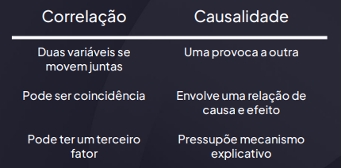
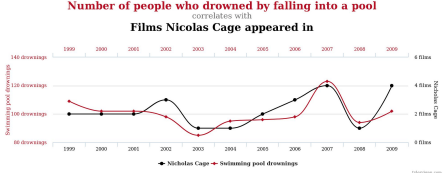
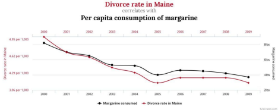

# Causalidade: cuidado com conclusões precipitadas

## Sorvete causa afogamento?

(Esta é a aula onde você aprende que ver duas coisas acontecendo juntas não significa que uma causou a outra.)

## A diferença entre correlação e causalidade

### Exemplo clássico

Taxa de afogamentos e consumo de sorvete sobem juntos.

❌ Correlação verdadeira, mas a causa é o calor (variável oculta).

### Exemplo corporativo

Clientes que usam mais o app compram mais.

❌ Isso não significa que "usar o app causa aumento de compras". Pode ser que clientes mais engajados já comprariam mais de qualquer forma.

## O que é causalidade então?

- ● Implica relação de dependência real
- ● Envolve temporalidade (causa vem antes)
- ● Precisa de mecanismo explicativo
- ● Pode ser testada com experimentos ou modelo mais robustos

## Ferramentas de identificação de causalidade

- ● Testes com grupo de controle
- ● Randomização
- ● Variáveis instrumentais
- ● Diferencias em diferenças (diff-in-diff)

## O que são relações espúrias?

Relações que parecem reais, mas são causadas por uma terceira variável ou coincidência.

## Correlação não implica causalidade

## Vieses em análise de dados

- ● Viés de seleção
- ● Viés de sobrevivência
- ● Viés de confirmação
- ● Viés de omissão de variáveis relevantes

## Viés de seleção

Uma empresa avalia a satisfação dos clientes apenas entre aqueles que respondem uma pesquisa por e-mail.

- ❌ Problema: Quem responde tende a ser ou muito satisfeito ou muito insatisfeito. A maioria silenciosa (neutra) fica de fora.
- 📉 Conclusão errada: “Todos nossos clientes amam ou odeiam o produto!”
- ✔ Correto seria: “Estamos vendo só os extremos.”

## Viés de sobrevivência

Na Segunda Guerra, engenheiros reforçavam as partes dos aviões onde havia mais furos nos que retornavam das batalhas.

- ❌ Erro: Só estavam olhando os aviões que voltaram.
- ✈ Os que caíram podiam ter sido atingidos em pontos críticos que não aparecem nas análises.
- 📉 Conclusão errada: “Essas partes são mais atingidas.”

## Viés de confirmação

Um gestor acredita que trabalhar de casa reduz produtividade. Ele só analisa casos em que o home office deu errado.

- ❌ Problema: Ele ignora os dados que mostram aumento de produtividade em outras equipes.
- 📉 Conclusão errada: “Home office é ineficiente.”
- ✔ Correto seria: “Os resultados são diversos, e dependem do contexto.”

## Viés de omissão de variáveis relevantes

Você compara salários entre dois departamentos e nota que o de TI ganha mais.

- ❌ Conclusão: “TI paga mais por cultura.”
- ✔ Mas você esqueceu de considerar nível de formação e tempo de empresa — que eram maiores na TI.
- 📉 Resultado: Você atribui a diferença salarial a um fator errado.

## Como evitar conclusões precipitadas?

- ● Pergunte: "Faz sentido que isso cause aquilo?"
- ● Busque validação cruzada com outros dados
- ● Desconfie de p-valores baixos sem contexto

## Check de causalidade rápido (mental)

- ❏ O efeito é consistente ao longo do tempo?
- ❏ Há um mecanismo plausível?
- ❏ Existe temporalidade?
- ❏ A relação se sustenta em subgrupos?
