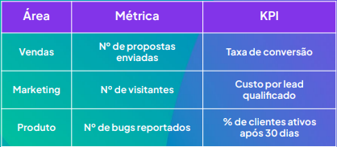

# Métricas x KPIs: o que realmente importa?

## O que é uma métrica?

Métrica = qualquer número que você podo medir

Exemplos:

- Número de visitas no site
- Total de vendas no mês
- Taxa de cliques no e-mail

## O que é um KPI?

KPI = Indicador-chave de performance

Exemplos:

- CAC (Custo de aquisição de cliente)
- Taxa de conversão por canal
- Retenção de clientes após 90 dias

## Métricas x KPIs

## Como saber se é KPI?

3 perguntas para identificar um KPI

1. Está ligado a um objetivo de negócio?
2. Ajuda a tomar decisão?
3. É sensível à ação (se eu mexer, muda o resultado)?

## Erros comuns na escolha de KPIs

- Escolher o que é mais fácil de medir
- Ter muitos KPIs ao mesmo tempo
- Usar métricas de vaidade (ex: seguidores, curtidas)

Um bom KPI exige intencionalidade. Métrica de vaidade pode te deixar feliz, mas não mostra se o negócio está indo bem.

Comparando métrica e KPI em diferentes áreas

## Conclusão

- Métrica ≠ KPI
- KPI é estratégico, ligado a metas e decisões
- Escolha poucos e bons KPIs por área

Dados só viram ação quando você mede o que importa…
