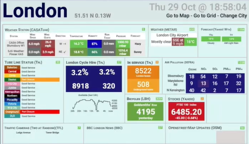
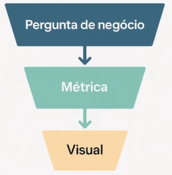
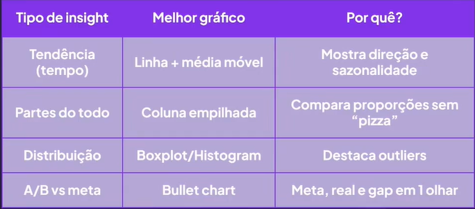
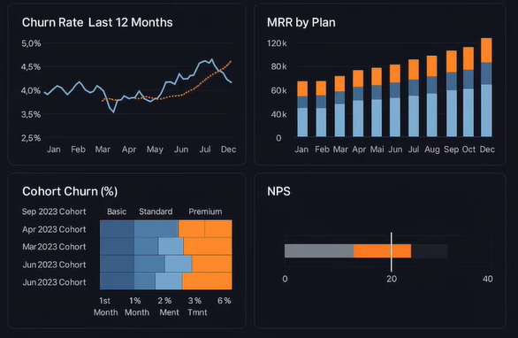
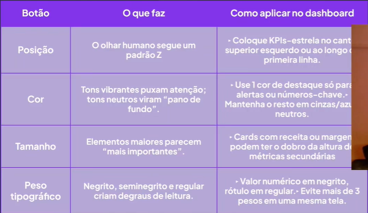
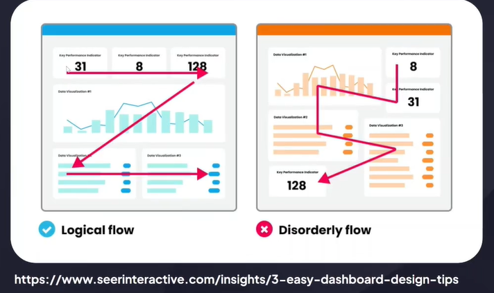
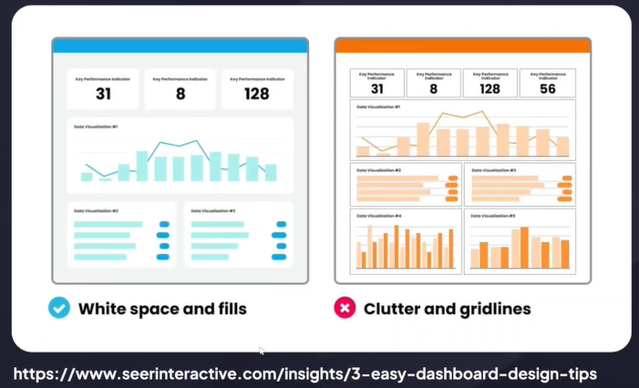
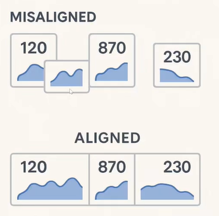
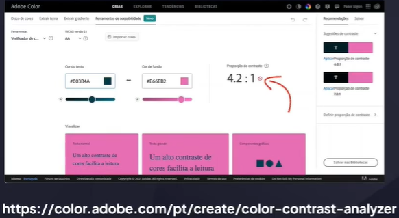
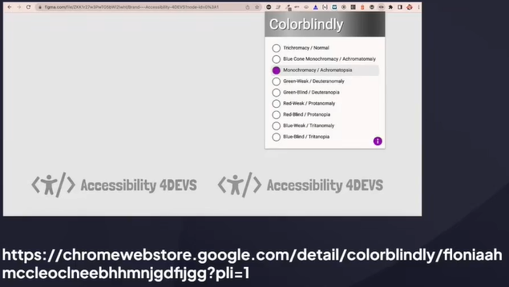

# Definindo os insights certos para o DataViz

## Objetivo

Você já abriu um dashboard e pensou 'por onde começo?'

## O erro clássico

Excesso de dados acaba com a decisão

## Funil dos insights

1. Pergunta de negócio

"Por que a receita de assinaturas premium caiu 8% no último trimestre?"

2. Quebrar em sub-perguntas
   1. "Esse declínio é isolado ou tendência?"
   2. "Quais segmentos cancelaram mais?"
   3. "Houve mudança de preço ou UX?"

3. Métricas-chave
   - Churn rate premium (últimos 12 meses)
   - MRR premium mês a mês
   - Churn por cohort (1º, 2º, 3º mês)
   - NPS premium pós-mudança de UX

STATUS | CAUSA-PROVÁVEL | AÇÃO

4. Escolha visual
   
   - Métrica 1: Linha com média móvel (Churn rate 12m)
   - Métrica 2: Coluna empilhada (MRR por plano)
   - Métrica 3: Heat-map de cohort (churn 1º - 6º mês)
   - Métrica 4: Bullet chart (NPS atual x meta)

## Checklist 'Vale mostrar?'

- Impacta decisão?
- Existe ação?
- Público entende?
- Dados confiáveis?

## Identificação do público

## Boas práticas

- Tempo de carregamento ideal < 3s.
- Filtros pré-salvos por persona.
- Evite 10 + parãmetros em cascata.
- Tudo nomeado, sem ambiguidade.

## Como testar em 30 segundos

3 perguntas para identificar um bom dashboard

1. Mostre o dashboard a alguém que nunca viu.
2. Peça: "Diga-me os dois números mais importantes que você vê."
3. Se a resposta não bate com o que você idealizou, revise cor/posição/tamanho.

## Design inclusivo

Constraste mínimo de 4.5:1 (WCAG)

Cuidado com cores

Texto >= 12pt (desktop)

## Conslusão

- Dados só viram insights quando respondem a uma dúvida de negócio.
- Simplicidade limpa rúido, hierarquia guia o olhar, clareza evita ambiguidade.

Se o seu dashboard desaparecesse hoje, qual decisão a empresa não conseguiria mais tomar?
