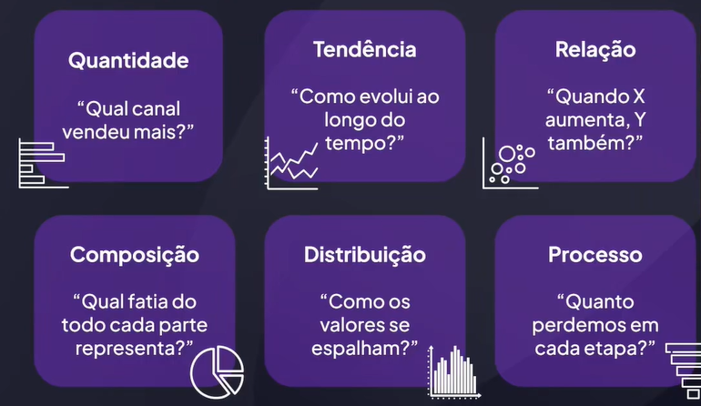

# Tipos de gráficos e quando usar cada um

## Objetivo

Saber escolher o gráfico que conta melhor a história

### Indicação literária

- Storytelling com dados
- Data Story
- Como mentir com estatística

## Por que importa?

50% dos executivos afirma sentir-se sobrecarregados pela quantidade de dados e dashboard

## Visão geral

## Barra / Coluna

- Comparar valores entre categorias (ex: vendas por região).
- Dados: rótulo + valor, eixo Y começando em zero.
- Evitar: 3D, 15 + barras, eixo cortado.

## Linha

- Mostrar evolução temporal contínua (ex: churn mensal).
- Dados: data ordenada + valor.
- Dica: adicione média móvel para suavizar ruído.

## Área empilhada

- Combinar tendência + composição (market-share ao longo do tempo).
- Limite a 4-5 séries para não virar "lasanha".

## Barra empilhada

- Comparar composição entre grupos (vendas por país e canal).
- Informar total e fatias melhor que pizza múltipla.
- Evitar empilhar valores negativos.

## Funil

- Perdas em etapas sequenciais (leads -> propostas -> fechados).
- Largura proporcional à queda; checar se soma faz sentido.

## Dispersão (Scatter)

- Relação / correlação entre duas variáveis (CPC x conversão).

## Bolha

- Mesma lógica do scatter com terceira variável no tamanho.
- Atenção: área da bolha deve representar valor, não o raio.

## Histograma

- Distribuição de uma métrica contínua (valor de compra).
- Precisa de amostra >= 50 - 100 pontos; escolha intervalos coerentes.

## Boxplot

- Comparar distribuições entre grupos (salário por área).
- Mostra mediana, quartis, outliers; explicar "bigodes" ao público.

## Bullet chart

- Meta x real de um KPI (NPS, receita).
- Pouco espaço; verde acima da meta, vermelho abaixo.

## Heat-map

- Intensidade em duas dimensões (hora x dia, churn por cohort).
- Paleta percentual; adicionar rótulos ou tooltip para daltonismo.

## Radar

- Perfil multivariável (skills do time).
- Até 5-6 eixos; mais que isso vira confusão.

## Tabela (sim, tabela)

- Quando o valor exato importa mais que a forma (relação de preços).
- Use zebra striping, alinhamento decimal; não "dump" de 200 colunas.

## Pie chart (A famosa)

- Partes de um único 100% (orçamento).
- Máximo 5 fatias; não usar em séries temporais.

## Regra de bolso

1. Pergunta -> verbo
   - Comparar? -> Barra / Coluna
   - Evoluir? -> Linha / Área
   - Compor? -> Donut ou Empilhada
   - Relacionar? -> Dispersão / Bolha
   - Distribuir? -> Histograma / Boxplot
   - Processar? -> Funil / Sankey
2. <= 5 KPIs, <= 3 cores fortes, eixo zero nas barras.
3. Teste rápido: mostre o rascunho por 5s; se a pessoa falar a mensagem certa, o gráfico serve. Se ela perguntar "o que é isso?", troque o tipo ou simplifique.

## Conslusão

Pergunta de negócio -> gráfico certo
