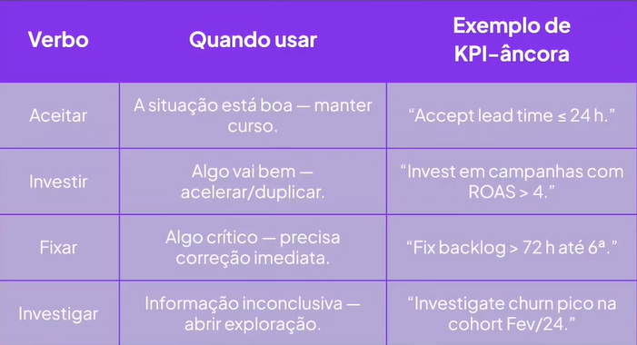
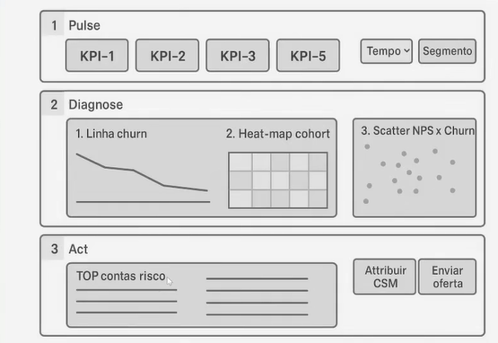
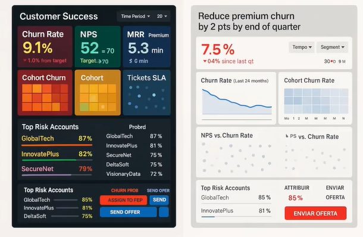

# Como planejar um dashboard do zero

## Ostras x Pérolas

Mostre apenas a pérola (mas tenha em mão as ostras, se necessário)

## Modelo WHO - WHAT - HOW

- Quem é o público
- O que eles devem fazer?
- Como você vai entregar

## WHO

- CEO - "Estamos batendo meta? Há riscos?" - Baixíssimo
- Gestor - "Onde ajustar para atingir a meta?" - Médio
- Líder - "Há anomalias? Qual é a causa raiz?" - Alto

1. Qual decisão periódica você precisa tomar (e em que frequência)? Descobre o objetivo de negócio e define a cadência de atualização do painel.
2. Que métrica, se variar em 1 ponto, afeta diretamente seu bônus ou meta? Revela o KPI-âncora que deve aparecer na primeira dobra.
3. Quanto tempo, em média, você pode dedicar a analisar o dashboard por sessão? Determina a profundidade de detalhe e o volume de informação que cabem na tela inicial.
4. Quando um indicador piora, até que nível de detalhe você precisa chegar para agir com confiança? Indica a necessidade (ou não) de drill-downs, filtros e explicações complementares.
5. Se o dashboard sumisse amanhã, qual decisão você não conseguiria mais tomar com segurança?

## WHAT

## How

- Looker Studio
- Google Slides
- PDF

## Agora vem a BIG IDEA...

A menor frase capaz de explicar por que o dashboard importa e o que o público deve fazer em seguida.

## ...e só depois o material

- Tema do dashboard: "Reduzir churn premium em 2 p.p até o fim do trimestre" (Big Idea já definido).
- Persona primária: VP de Customer Success (consulta 10 min pela manhã, precisa agir rápido).
- Storyboard: Linha de cima - cinco KPIs-estrela-em 10s o VP vê se o churn saiu da meta. Depois, linha de diagnóstico - tendência de 24 meses para contexto, heat-map para entender se o problema está em cohorts recentes, scatter para ligar satisfação ao churn por canal. Por fim, lista de contas em risco (Dashboard termina em AÇÃO, não em contemplação).

Está bom quando não tiver mais nada a tirar.

## Checklist plan-to-build

1. Conteúdo & Navegação
   - KPI-âncora primeiro, barras sempre com eixo zero.
   - Máximo 2 níveis de drill-down para achar causa raiz.
   - Limitar filtros a Tempo, Segmento, Região.
2. Design & Acessibilidade
   - Contraste mínimo 4.5 : 1; Teste em greyscale.
   - Usar <= 3 cores principais; Cor forte só em destaque.
   - Texto >= 12 pt (desktop); Rótulos claros.
3. Performance
   - Garantir carregamento < 3s (amostra, indexação, cache).
   - Exibir "Atualizado às..." no topo para confiança.
4. Governança
   - Nome do owner + versão no rodapé.
   - Documentar política de rollback e changelog.
5. QA & Adoção
   - Validar com >= 3 usuários alvo.
6. Go-Live
   - Executar "buddy-check 15s" final: colega localiza KPI-âncora sem ajuda.

